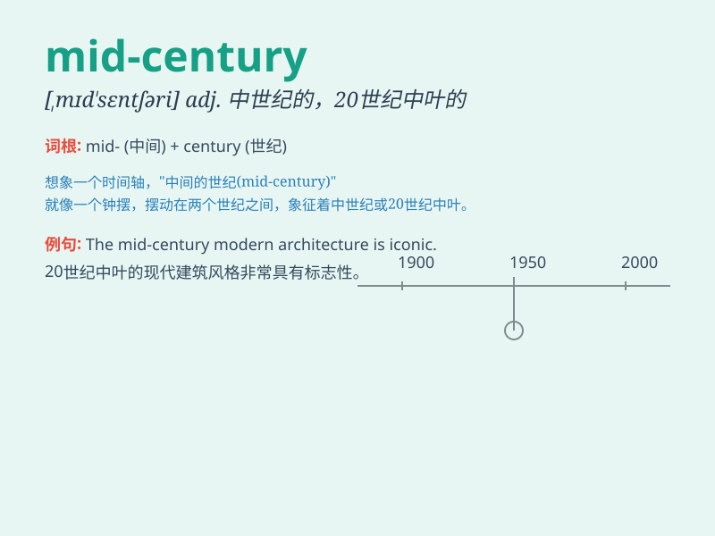

## mid-century

**英音:** _[ˌmɪd ˈsentʃəri]_ **美音:** _[ˌmɪd
ˈsentʃəri]_

**译义:** *n. 中世纪中期；20 世纪中期*

### 短语

+ **mid-century modern:** _20 世纪中期的现代风格_

+ **mid-century design:** _20 世纪中期的设计_

+ **mid-century architecture:** _20 世纪中期的建筑_

+ **mid-century furniture:** _20 世纪中期的家具_

+ **mid-century style home:** _20 世纪中期风格的住宅_

### 例句

#### 例句1

> **The design of this building reflects the style of mid-century
modernism.**

**中文翻译:** 这座建筑的设计反映了中世纪现代主义的风格。

**单词释义:** 中世纪

#### 例句2

> **Mid-century furniture is highly sought after by collectors.**

**中文翻译:** 中世纪的家具深受收藏家们的追捧。

**单词释义:** 中世纪

#### 例句3

> **The art exhibition showcases works from the mid-century
period.**

**中文翻译:** 这个艺术展览展示了来自中世纪时期的作品。

**单词释义:** 中世纪

### 背诵小故事

> In the mid-century, a time traveler found a hidden treasure chest. It
was exactly at the middle point of that century. This adventure made the
term \'mid-century\' unforgettable for him.

**在世纪中叶，一位时间旅行者发现了一个隐藏的宝箱。就在那个世纪的中间点。这次冒险让他永远记住了'mid-century（世纪中叶）'这个词。**

### 图义

