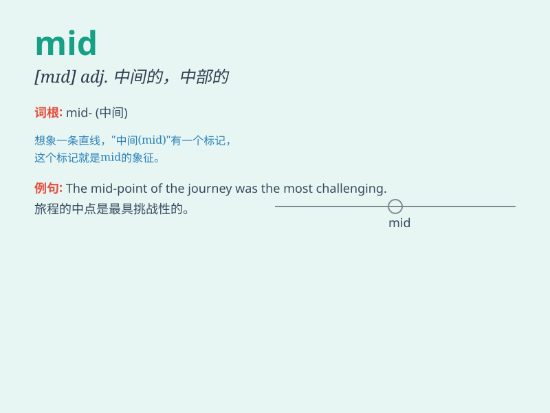

## mid

**英音:** _[mɪd]_ **美音:** _[mɪd]_

**译义:** *adj.中央的,中部的,中间的*

### 短语

+ **mid-air:** _半空中_

+ **mid-morning:** _上午中段时间_

+ **mid-afternoon:** _下午中段时间_

+ **mid-term:** _中期；期中_

+ **mid-sentence:** _话说到一半_

### 例句

#### 例句1

> **The town is located in mid Wales.**

**中文翻译:** 该镇位于威尔士中部。

**单词释义:** 中部的

#### 例句2

> **He was in mid conversation when I entered the room.**

**中文翻译:** 当我进入房间时，他正在谈话。

**单词释义:** 中途

#### 例句3

> **The mid morning sun was warm on our backs.**

**中文翻译:** 中午的阳光照在我们的背上，暖洋洋的。

**单词释义:** 上午中旬的

### 背诵小故事

> In the middle of a vast forest, a little bird was lost. It kept
flying mid the tall trees, trying to find its way home. Finally, it saw
a bright light and found its way out. \'Mid\' means in the middle.

**在一片广阔的森林中间，一只小鸟迷路了。它一直在高大的树木中间飞，试图找到回家的路。最后，它看到了一道亮光，找到了出路。\'mid\'意思是在中间。**

### 图义

