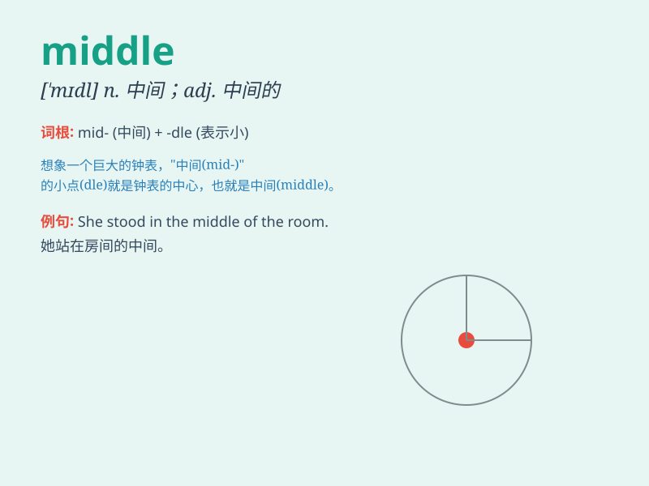

## middle

**英音:** _[\'mɪd(ə)l]_ **美音:** _[\'mɪdl]_

**译义:** *n.中间,当中adj.中间的,中部的*

### 短语

+ **middle school:** _中学_

+ **middle age:** _中年_

+ **middle class:** _中产阶级_

+ **in the middle of:** _在\...\...中间_

+ **middle ground:** _中间立场；中间地带_

### 例句

#### 例句1

> **He stood in the middle of the room.**

**中文翻译:** 他站在房间中央。

**单词释义:** 中间

#### 例句2

> **The middle child is often overlooked.**

**中文翻译:** 排行中间的孩子常常被忽视。

**单词释义:** 中间的

#### 例句3

> **She was in her middle thirties.**

**中文翻译:** 她三十多岁了。

**单词释义:** 中年的

### 背诵小故事

> In a big race, all the runners were running fast. But one runner was
always in the middle of the group. No matter how hard he tried, he
stayed in the middle. Finally, he understood that \'middle\' means
neither at the front nor at the back.

**在一场大型比赛中，所有的赛跑者都跑得很快。但有一个赛跑者总是在队伍的中间。不管他怎么努力，他都停留在中间。最后，他明白了'middle'意味着既不在前面也不在后面。**

### 图义

