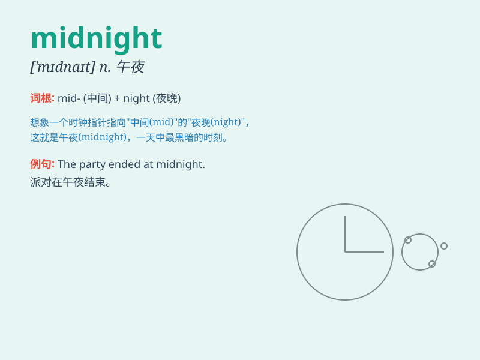

## midnight

**英音:** _[\'mɪdnaɪt]_ **美音:** _[\'mɪdnaɪt]_

**译义:** *n.午夜*

### 短语

+ **at midnight:** _在午夜_

+ **midnight snack:** _夜宵_

+ **midnight blue:** _深蓝色_

+ **midnight oil:** _熬夜苦干_

+ **midnight mass:** _午夜弥撒_

### 例句

#### 例句1

> **I usually go to bed before midnight.**

**中文翻译:** 我通常在午夜之前上床睡觉。

**单词释义:** 午夜

#### 例句2

> **The train left at midnight.**

**中文翻译:** 火车半夜出发。

**单词释义:** 午夜

#### 例句3

> **She came home at midnight and her parents were very angry.**

**中文翻译:** 她半夜回到家，她的父母很生气。

**单词释义:** 午夜

### 背诵小故事

> One night, a brave adventurer was on a journey. When the clock struck
twelve and the world was darkest, that was midnight. The adventurer had
to be extra careful as strange sounds filled the air.

**一天晚上，一位勇敢的冒险家正在旅途中。当钟敲响十二点，世界最黑暗的时候，那就是午夜。冒险家必须格外小心，因为空气中充满了奇怪的声音。**

### 图义

