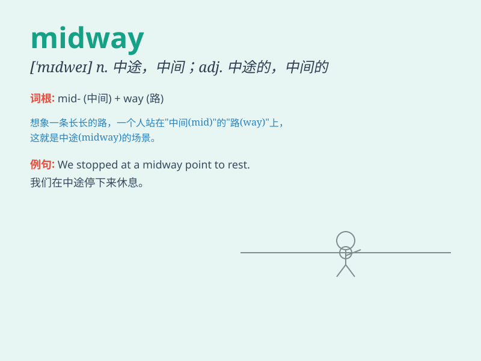

## midway

**英音:** _[\'mɪdweɪ; mɪd\'weɪ]_ **美音:** _[\'mɪd\'we]_

**译义:** *n.中途,半路adj.中途的adv.在中途*

### 短语

+ **midway point:** _中途点；中间点_

+ **midway through:** _在\...\...的中途_

+ **midway between:** _在\...\...中间；介于\...\...之间_

+ **midway station:** _中途站_

+ **midway position:** _中间位置_

### 例句

#### 例句1

> **The car broke down midway through the journey.**

**中文翻译:** 汽车在半路上抛锚了。

**单词释义:** 在中途；在中间

#### 例句2

> **We met midway between our houses.**

**中文翻译:** 我们在我们家的中间相遇了。

**单词释义:** 在......中间

#### 例句3

> **The performance was stopped midway due to technical problems.**

**中文翻译:** 由于技术问题，演出中途停止。

**单词释义:** 中途

### 背诵小故事

> One day, I was on a long journey. When I was midway, I felt very
tired but still decided to keep going. Finally, I reached my
destination. Remember, \'midway\' is the middle point of a journey or
process.

**有一天，我在一次长途旅行中。当我走到中途（midway）时，我感到非常累，但仍然决定继续前进。最后，我到达了目的地。记住，'midway'是旅程或过程的中间点。**

### 图义

