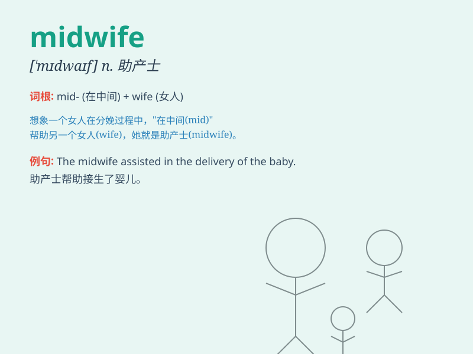

## midwife

**英音:** _[\'mɪdwaɪf]_ **美音:** _[\'mɪd\'waɪf]_

**译义:** *n.助产士,接生员,产婆*

### 短语

+ **trained midwife:** _受过培训的助产士_

+ **experienced midwife:** _经验丰富的助产士_

+ **certified midwife:** _有证书的助产士_

+ **community midwife:** _社区助产士_

+ **hospital midwife:** _医院助产士_

### 例句

#### 例句1

> **The midwife helped the mother deliver the baby safely.**

**中文翻译:** 助产士帮助母亲安全分娩。

**单词释义:** 助产士

#### 例句2

> **She trained to become a midwife to assist in childbirth.**

**中文翻译:** 她接受培训成为一名助产士，协助分娩。

**单词释义:** 助产士

#### 例句3

> **The midwife has years of experience in her profession.**

**中文翻译:** 助产士在其专业领域拥有多年经验。

**单词释义:** 助产士

### 背诵小故事

> A long time ago, in a small village, there was a woman named Mary.
She was always in the middle of helping other women give birth. So,
people called her \'midwife\', meaning a person who assists in
childbirth.

**很久以前，在一个小村庄里，有个叫玛丽的女人。她总是在帮助其他妇女生孩子的过程中。所以，人们称她为"助产士"，意思是协助分娩的人。**

### 图义

