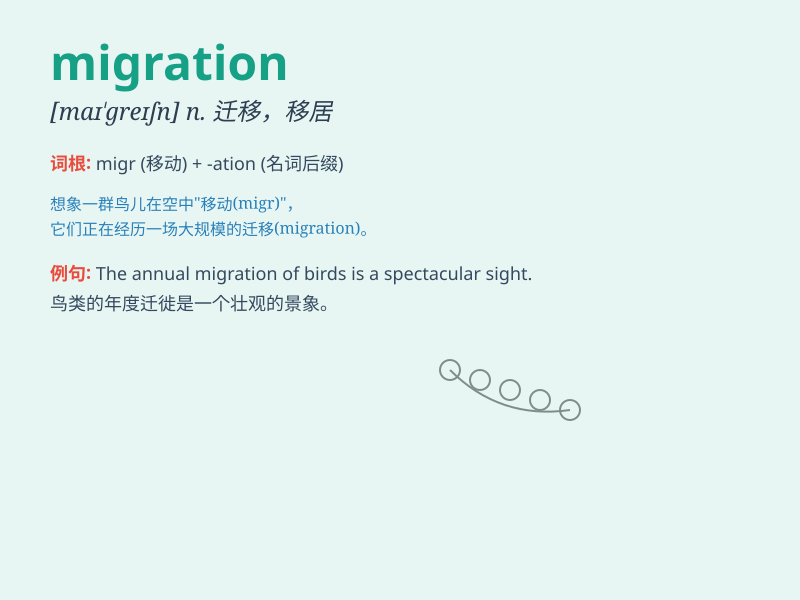

## migration

**英音:** _[maɪ\'greɪʃ(ə)n]_ **美音:** _[maɪ\'ɡreʃən]_

**译义:** *n.移民,移植,移往,移动*

### 短语

+ **bird migration:** _鸟类迁徙_

+ **migration pattern:** _迁移模式_

+ **mass migration:** _大规模迁移_

+ **seasonal migration:** _季节性迁移_

+ **human migration:** _人类迁徙_

### 例句

#### 例句1

> **The migration of birds is a remarkable phenomenon.**

**中文翻译:** 鸟类的迁徙是一个引人注目的现象。

**单词释义:** 迁徙

#### 例句2

> **There has been a large-scale migration of workers to the
cities.**

**中文翻译:** 工人大规模向城市迁移。

**单词释义:** 迁移

#### 例句3

> **The government is trying to control illegal migration.**

**中文翻译:** 政府正在努力控制非法移民。

**单词释义:** 移民

### 背诵小故事

> A group of birds decided to make a migration. They flew a long
distance to find a warmer place. They faced many challenges but kept
going. Finally, they reached their destination. Migration means moving
from one place to another.

**一群鸟儿决定迁徙。它们长途飞行去寻找更温暖的地方。它们面临诸多挑战但仍继续前行。最终，它们到达了目的地。migration
意思是从一个地方迁移到另一个地方。**

### 图义

