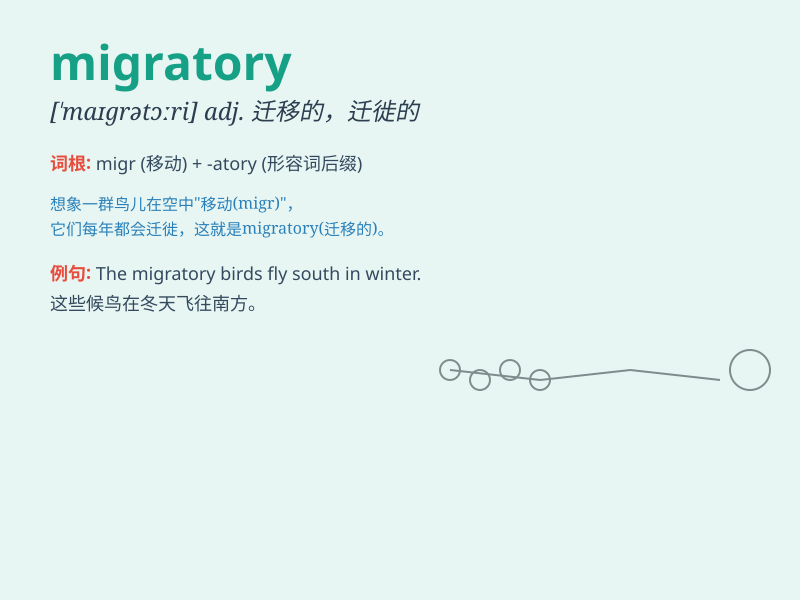

## migratory

**英音:** _[\'maɪgrət(ə)rɪ; maɪ\'greɪt(ə)rɪ]_ **美音:**
_[\'maɪɡrətɔri]_

**译义:** *adj.迁移的,流浪的*

### 短语

+ **migratory bird:** _候鸟_

+ **migratory route:** _迁徙路线_

+ **migratory worker:** _流动工人；季节性工人_

+ **migratory instinct:** _迁徙本能_

+ **migratory fish:** _洄游鱼类_

### 例句

#### 例句1

> **Some birds have migratory habits and fly to warmer places in
winter.**

**中文翻译:** 有些鸟类有迁徙的习性，冬天会飞到较温暖的地方。

**单词释义:** 迁徙的

#### 例句2

> **The migratory route of whales is a mystery to scientists.**

**中文翻译:** 鲸鱼的迁徙路线对科学家来说一直是个谜。

**单词释义:** 迁徙的

#### 例句3

> **Migratory workers often face many challenges in a new city.**

**中文翻译:** 外来务工人员在新城市往往会面临许多挑战。

**单词释义:** 流动的

### 背诵小故事

> A group of migratory birds flew a long distance. They left their old
home to find a warmer place. Their migratory journey was full of
challenges but also hope for a better life.

**一群候鸟飞了很长的距离。它们离开旧家去寻找更温暖的地方。它们的迁徙之旅充满挑战，但也充满对更好生活的希望。**

### 图义

