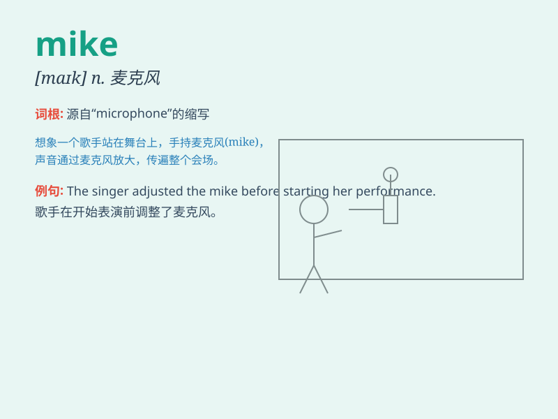

## mike

**英音:** _[maɪk]_ **美音:** _[maɪk]_

**译义:** *n.麦克风,微克 Mike 迈克(男子名)*

### 短语

+ **mike check:** _话筒试音_

+ **open mike:** _开放麦克风；即兴发言时段_

+ **mike stand:** _麦克风架_

+ **wireless mike:** _无线麦克风_

+ **mike input:** _麦克风输入_

### 例句

#### 例句1

> **Mike is a very talented musician.**

**中文翻译:** 迈克是一位非常有才华的音乐家。

**单词释义:** 人名，迈克

#### 例句2

> **I saw Mike at the supermarket yesterday.**

**中文翻译:** 我昨天在超市见到迈克。

**单词释义:** 人名，迈克

#### 例句3

> **Mike has been working hard for the exam.**

**中文翻译:** 迈克一直在努力准备考试。

**单词释义:** 人名，迈克

### 背诵小故事

> One day, Mike was lost in a forest. He shouted loudly for help.
Luckily, a kind hunter heard him and led him out. From then on, Mike
learned to be more careful when exploring.

**有一天，迈克在森林里迷路了。他大声呼救。幸运的是，一位善良的猎人听到了他的呼喊并带他走了出来。从那以后，迈克学会了在探索时要更加小心。**

### 图义

