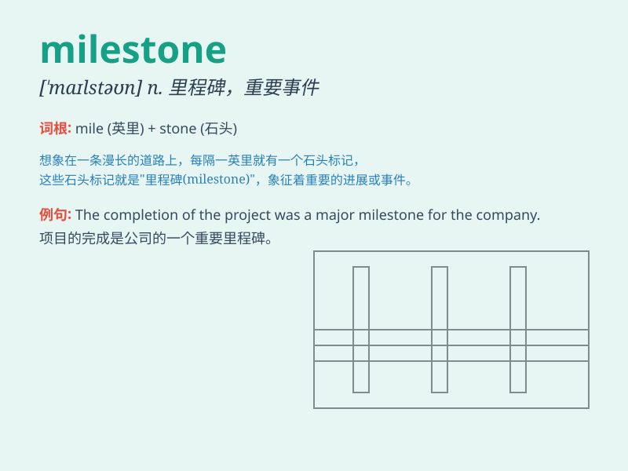

## milestone

**英音:** _[\'maɪlstəʊn]_ **美音:** _[\'maɪlston]_

**译义:** *n.里程碑,里程标,重要事件,转折点*

### 短语

+ **major milestone:** _重要的里程碑_

+ **career milestone:** _职业里程碑_

+ **reach a milestone:** _达到一个里程碑_

+ **key milestone:** _关键里程碑_

+ **project milestone:** _项目里程碑_

### 例句

#### 例句1

> **Reaching this sales target is a major milestone for our
company.**

**中文翻译:** 达到这一销售目标对我们公司来说是一个重要的里程碑。

**单词释义:** 重要的阶段或事件

#### 例句2

> **The invention of the printing press was a milestone in human
history.**

**中文翻译:** 印刷机的发明是人类历史上的一个里程碑。

**单词释义:** 具有重大意义的事件或阶段

#### 例句3

> **Passing the driving test was a milestone in her life.**

**中文翻译:** 通过驾驶考试是她人生中的一个里程碑。

**单词释义:** 重要的转折点或标志性事件

### 背诵小故事

> A young entrepreneur was working hard on his startup. When he finally
signed a big contract, it was a milestone. It marked a significant step
forward in his business journey, showing that his efforts were paying
off.

**一位年轻的企业家努力经营他的创业公司。当他最终签下一份大合同时，这是一个里程碑。它标志着他的商业之旅向前迈出了重要的一步，表明他的努力得到了回报。**

### 图义

