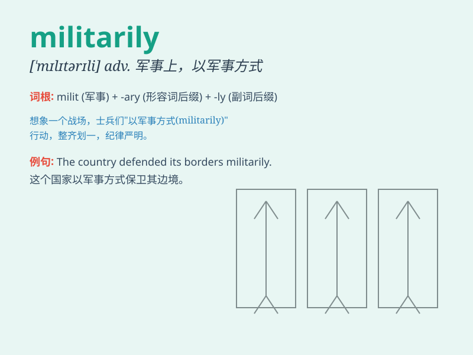

## militarily

**英音:** _null_ **美音:** _null_

**译义:** *adv.以武力,以军事行动*

### 短语

+ **militarily powerful:** _军事上强大_

+ **militarily occupied:** _军事占领_

+ **militarily trained:** _受过军事训练_

+ **militarily strategic:** _军事战略上的_

+ **militarily significant:** _具有军事重要性_

### 例句

#### 例句1

> **The country is strong militarily.**

**中文翻译:** 该国军事强盛。

**单词释义:** 在军事方面

#### 例句2

> **They have never been defeated militarily.**

**中文翻译:** 他们在军事上从未被击败过。

**单词释义:** 在军事上

#### 例句3

> **The region is strategically important militarily.**

**中文翻译:** 该地区具有重要的军事战略意义。

**单词释义:** 在军事上

### 背诵小故事

> A young soldier was lost in the forest. He had to find his way back
militarily, using his training and strategies. He remained calm and
finally reached the camp successfully.

**一位年轻的士兵在森林中迷路了。他不得不以军事的方式，运用他的训练和策略找到回去的路。他保持冷静，最终成功回到了营地。**

### 图义

