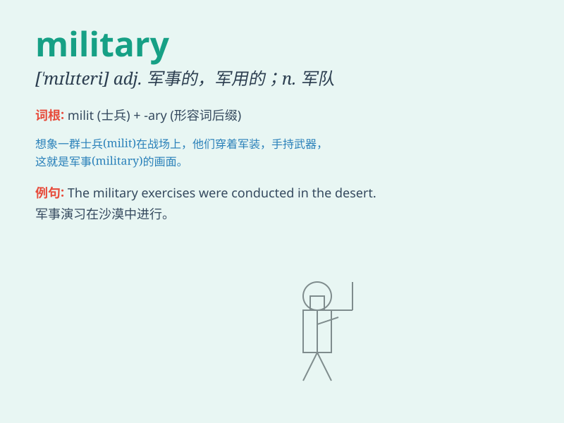

## military

**英音:** _[\'mɪlɪt(ə)rɪ]_ **美音:** _[\'mɪlətɛri]_

**译义:** *adj.军事的,军用的*

### 短语

+ **military training:** _军事训练_

+ **military service:** _兵役；服兵役_

+ **military force:** _军事力量_

+ **military base:** _军事基地_

+ **military uniform:** _军装；军服_

### 例句

#### 例句1

> **He joined the military after graduating from high school.**

**中文翻译:** 高中毕业后，他参军了。

**单词释义:** 军队；军事的

#### 例句2

> **The country has a strong military defense system.**

**中文翻译:** 该国拥有强大的军事防御体系。

**单词释义:** 军事的

#### 例句3

> **She is interested in military history.**

**中文翻译:** 她对军事史感兴趣。

**单词释义:** 军事的

### 背诵小故事

> A brave soldier named Mike was in the military. He trained hard every
day to protect his country. One day, he led his team to victory in a
dangerous battle. His military skills and courage were amazing.

**一位名叫迈克的勇敢士兵在军队里。他每天刻苦训练以保卫他的国家。有一天，他带领他的团队在一场危险的战斗中取得了胜利。他的军事技能和勇气令人惊叹。**

### 图义

