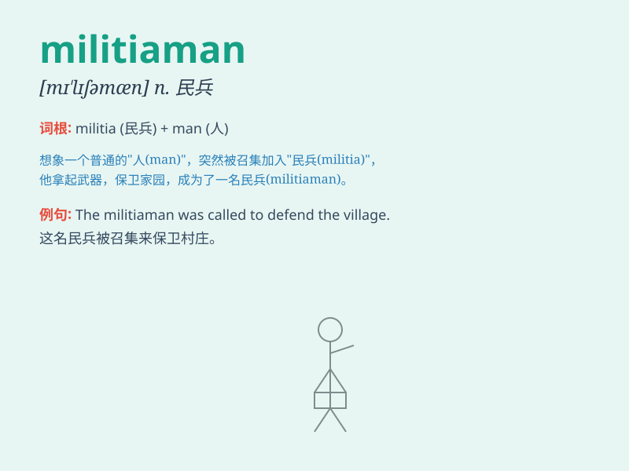

## militiaman

**英音:** _[mɪ\'lɪʃəmən]_ **美音:** _[mə\'lɪʃəmən]_

**译义:** *n.民兵组织,全体民兵,(只在紧急情况下才召集的)国民军*

### 短语

+ **militiaman training:** _民兵训练_

+ **experienced militiaman:** _经验丰富的民兵_

+ **local militiaman:** _当地民兵_

+ **armed militiaman:** _武装民兵_

+ **volunteer militiaman:** _志愿民兵_

### 例句

#### 例句1

> **The militiaman was on duty at the border.**

**中文翻译:** 民兵正在边境执勤。

**单词释义:** 民兵

#### 例句2

> **A group of militiamen were training in the field.**

**中文翻译:** 一群民兵正在野外训练。

**单词释义:** 民兵

#### 例句3

> **The militiaman bravely fought against the invaders.**

**中文翻译:** 这位民兵勇敢地与侵略者进行了战斗。

**单词释义:** 民兵

### 背诵小故事

> A brave young man was always passionate about protecting his
hometown. One day, when danger came, he joined the local militia and
became a militiaman. With his courage and skills, he safeguarded the
community.

**一位勇敢的年轻人一直热衷于保护他的家乡。有一天，当危险来临时，他加入了当地的民兵组织，成为了一名民兵。凭借他的勇气和技能，他保卫了社区。**

### 图义

