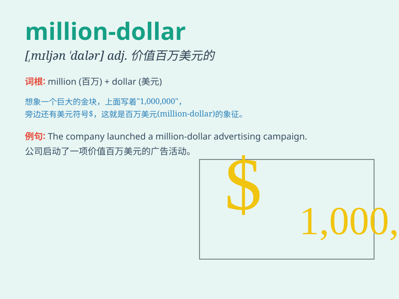

## million-dollar

**英音:** _[ˈmɪljən ˈdɒlə]_ **美音:** _[ˈmɪljən
ˈdɑːlər]_

**译义:** *adj.价值百万美元的；非常贵重的*

### 短语

+ **million-dollar deal:** _价值百万美元的交易_

+ **million-dollar question:** _关键问题；重要问题_

+ **million-dollar smile:** _迷人的微笑_

+ **million-dollar home:** _价值百万美元的房子_

+ **million-dollar business:** _百万美元的生意_

### 例句

#### 例句1

> **The million-dollar yacht is a symbol of luxury.**

**中文翻译:** 这艘价值百万美元的游艇是奢华的象征。

**单词释义:** 价值百万美元的

#### 例句2

> **She won a million-dollar lottery.**

**中文翻译:** 她中了百万美元的彩票。

**单词释义:** 百万美元的

#### 例句3

> **The million-dollar deal made him a rich man overnight.**

**中文翻译:** 这笔百万美元的交易让他一夜暴富。

**单词释义:** 百万美元的

### 背诵小故事

> A poor man dreamt of having a million-dollar lottery win. One day, he
found a mysterious ticket and it turned out to be the key to his
million-dollar fortune. With that money, he changed his life completely.

**一个穷人梦想着能中百万美元的彩票。有一天，他发现了一张神秘的彩票，结果这成了他获得百万美元财富的关键。有了这笔钱，他彻底改变了自己的生活。**

### 图义

