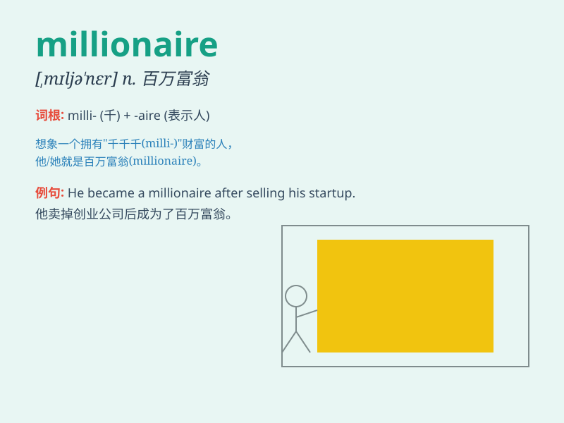

## millionaire

**英音:** _[mɪljə\'neə]_ **美音:** _[,mɪljə\'nɛr]_

**译义:** *n.百万富翁,大富豪*

### 短语

+ **self-made millionaire:** _白手起家的百万富翁_

+ **internet millionaire:** _互联网百万富翁_

+ **young millionaire:** _年轻的百万富翁_

+ **serial millionaire:** _连续创业成功的百万富翁_

+ **retired millionaire:** _退休的百万富翁_

### 例句

#### 例句1

> **He became a millionaire at a young age through his innovative
business ideas.**

**中文翻译:** 他凭借创新的商业理念，年轻时就成为了百万富翁。

**单词释义:** 百万富翁

#### 例句2

> **The millionaire donated a large sum of money to charity.**

**中文翻译:** 这位百万富翁向慈善机构捐赠了一大笔钱。

**单词释义:** 百万富翁

#### 例句3

> **She married a millionaire and led a luxurious life.**

**中文翻译:** 她嫁给了一位百万富翁，过着奢华的生活。

**单词释义:** 百万富翁

### 背诵小故事

> Once upon a time, a poor boy dreamed of becoming a millionaire. He
worked hard, saved money, and finally made it. With millions in his bank
account, he lived a happy life. Remember, millionaire means a person
with millions of dollars or wealth.

**从前，有一个贫穷的男孩梦想成为百万富翁。他努力工作，存钱，最终成功了。银行账户里有几百万，他过上了幸福的生活。记住，millionaire
意思是拥有数百万美元或财富的人。**

### 图义

