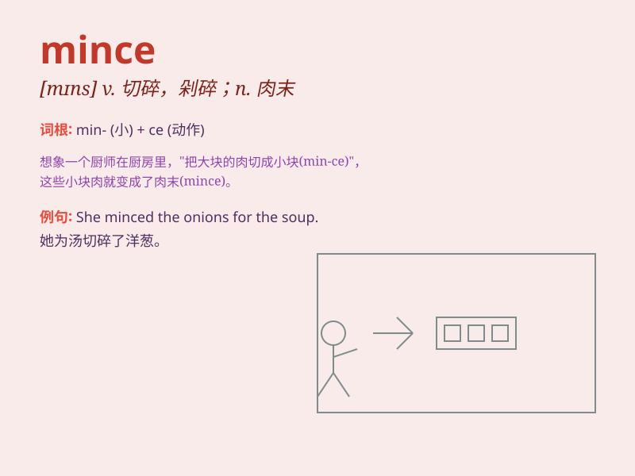

## mince

**英音:** _[mɪns]_ **美音:** _[mɪns]_

**译义:** *v.切碎*

### 短语

+ **mince words:** _说话不直截了当；委婉地说_

+ **mince pie:** _百果馅饼_

+ **mince meat:** _肉末；肉馅_

+ **not mince matters:** _直言不讳_

+ **mince no words:** _直言不讳_

### 例句

#### 例句1

> **She minced the meat finely for the dumplings.**

**中文翻译:** 她把肉切得很细，用来包饺子。

**单词释义:** 切碎

#### 例句2

> **He minced along the street, trying to look elegant.**

**中文翻译:** 他在街上小心翼翼地走着，努力让自己看起来优雅。

**单词释义:** 小步走

#### 例句3

> **Don\'t mince words; just tell me the truth.**

**中文翻译:** 不要拐弯抹角；告诉我真相吧。

**单词释义:** 拐弯抹角

### 背诵小故事

> A little girl was helping her mom in the kitchen. Her mom asked her
to mince the meat. The girl carefully cut the meat into very small
pieces. She did it so well and they made delicious dumplings together.

**一个小女孩在厨房帮妈妈忙。妈妈让她把肉切碎。小女孩仔细地把肉切成很小的块。她做得很好，她们一起做了美味的饺子。**

### 图义

