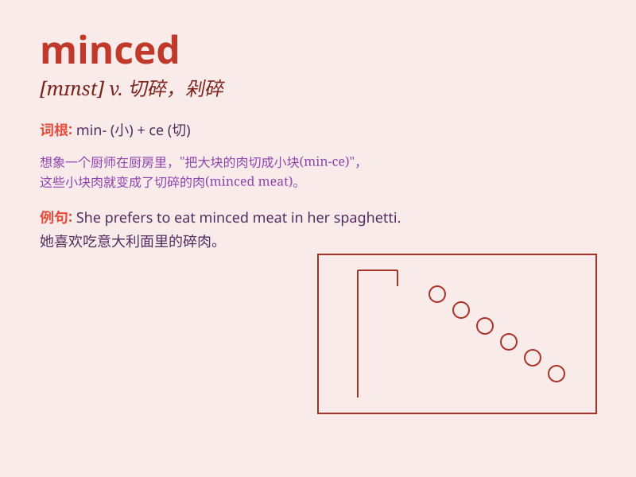

## minced

**英音:** _[mɪnst]_ **美音:** _[mɪnst]_

**译义:** *adj.切碎的，剁碎的；n.切碎的蔬菜或肉（常用复数形式）*

### 短语

+ **minced meat:** _肉末；肉馅_

+ **minced garlic:** _蒜末_

+ **minced ginger:** _姜末_

+ **minced onion:** _洋葱末_

+ **minced chicken:** _鸡肉末_

### 例句

#### 例句1

> **She minced the garlic finely for the recipe.**

**中文翻译:** 她为了这个食谱把大蒜切碎得很细。

**单词释义:** 切碎

#### 例句2

> **The chef minced the meat to make dumpling filling.**

**中文翻译:** 厨师把肉切碎来做饺子馅。

**单词释义:** 切碎

#### 例句3

> **He minced along the street, trying to look elegant.**

**中文翻译:** 他沿着街道迈着小碎步走，试图显得优雅。

**单词释义:** 迈着小碎步走

### 背诵小故事

> One day, I went to the market and saw the butcher mincing the meat
carefully. The minced meat was going to be used for making delicious
dumplings. I learned that \'minced\' means cut into very small pieces.

**有一天，我去市场，看到屠夫在仔细地把肉切碎。这些切碎的肉将被用来做美味的饺子。我了解到'minced'意思是切成很小的碎块。**

### 图义

