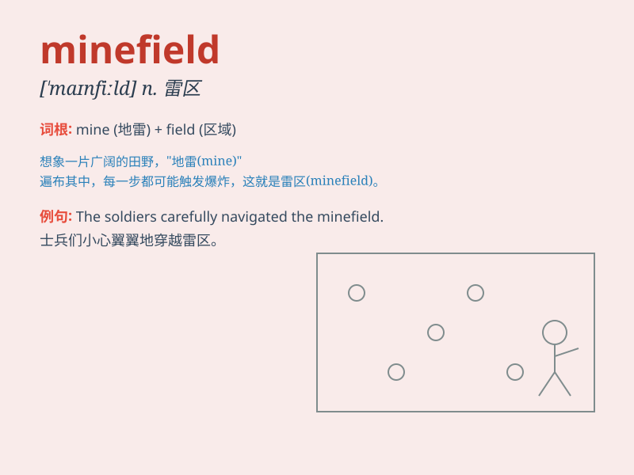

## minefield

**英音:** _[ˈmaɪnfɪld]_ **美音:** _[ˈmaɪnˌfild]_

**译义:** *n.雷区；地雷区；充满潜在危险的事物*

### 短语

+ **navigate a minefield:** _穿越雷区_

+ **step into a minefield:** _踏入雷区_

+ **minefield area:** _雷区地带_

+ **clear the minefield:** _清除雷区_

+ **be caught in a minefield:** _被困在雷区_

### 例句

#### 例句1

> **The negotiations were a minefield of potential
misunderstandings.**

**中文翻译:** 这次谈判充满了潜在误解的雷区。

**单词释义:** 充满危险的区域

#### 例句2

> **The political situation in that country is a minefield for any
diplomat.**

**中文翻译:** 那个国家的政治局势对任何外交官来说都是一个雷区。

**单词释义:** 危险局势；棘手的情况

#### 例句3

> **Navigating the minefield of office politics can be
challenging.**

**中文翻译:** 在办公室政治的雷区中周旋可能具有挑战性。

**单词释义:** 复杂且危险的局面

### 背诵小故事

> Imagine a soldier walking through a vast area. There are hidden
explosives everywhere. This dangerous place is a minefield. One wrong
step and BOOM! It\'s a scary but clear image of\'minefield\'.

**想象一名士兵行走在广阔的区域。到处都隐藏着爆炸物。这个危险的地方就是雷区。走错一步就会'砰'！这是一个关于'minefield（雷区）'的可怕但清晰的画面。**

### 图义

