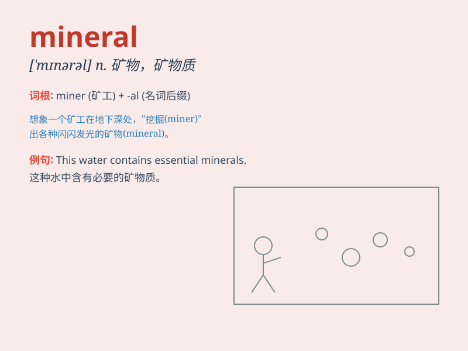

## mineral

**英音:** _[\'mɪn(ə)r(ə)l]_ **美音:** _[\'mɪnərəl]_

**译义:** *n.矿物,矿石*

### 短语

+ **mineral water:** _矿泉水_

+ **mineral deposit:** _矿床；矿藏_

+ **mineral resources:** _矿产资源_

+ **mineral oil:** _矿物油_

+ **mineral spring:** _矿泉_

### 例句

#### 例句1

> **The country is rich in mineral resources.**

**中文翻译:** 该国矿产资源丰富。

**单词释义:** 矿物质；矿产

#### 例句2

> **Mineral water is good for your health.**

**中文翻译:** 矿泉水对您的健康有益。

**单词释义:** 矿物质的；含矿物质的

#### 例句3

> **She studies the properties of various minerals.**

**中文翻译:** 她研究各种矿物的特性。

**单词释义:** 矿物质

### 背诵小故事

> One day, while exploring a cave, Tom found some shiny objects. An
expert told him they were minerals. These minerals were like hidden
treasures in the dark cave, waiting to be discovered.

**有一天，汤姆在探索一个洞穴时，发现了一些闪闪发光的东西。一位专家告诉他，这些是矿物质。这些矿物质就像隐藏在黑暗洞穴中的宝藏，等待着被发现。**

### 图义

