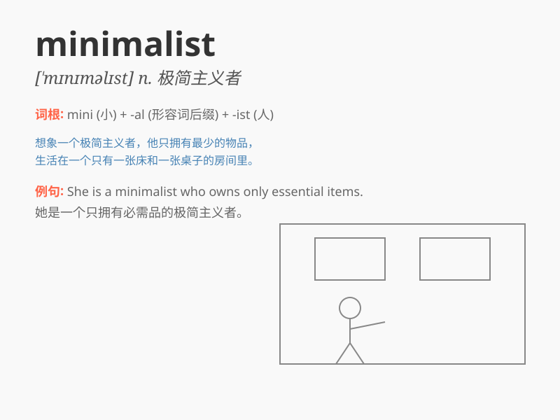

## minimalist

**英音:** _[\'mɪnɪm(ə)lɪst]_ **美音:** _[\'mɪnɪmlɪst]_

**译义:** *n.最低限要求者,最低纲领主义者*

### 短语

+ **minimalist design:** _极简主义设计_

+ **minimalist lifestyle:** _极简主义生活方式_

+ **minimalist art:** _极简主义艺术_

+ **minimalist approach:** _极简主义方法_

+ **minimalist wardrobe:** _极简主义衣橱_

### 例句

#### 例句1

> **The designer has a minimalist style, using only essential
elements.**

**中文翻译:** 这位设计师有一种极简主义风格，只使用必要的元素。

**单词释义:** 极简主义的

#### 例句2

> **She decorated her apartment in a minimalist way to create a sense
of space.**

**中文翻译:** 她以极简主义的方式装饰她的公寓，以营造出空间感。

**单词释义:** 极简主义的

#### 例句3

> **The minimalist furniture in the room gives it a modern look.**

**中文翻译:** 房间里的极简主义家具使它看起来很现代。

**单词释义:** 极简主义的

### 背诵小故事

> A designer
always追求极简，他被称为minimalist。他的作品没有多余装饰，一切从简。简单的线条，少量的色彩，却创造出独特魅力。他坚信，少即是多，极简带来纯粹与美好。

**一位设计师总是追求极简，他被称为极简主义者。他的作品没有多余的装饰，一切从简。简单的线条，少量的色彩，却创造出独特的魅力。他坚信，少即是多，极简带来纯粹与美好。**

### 图义

