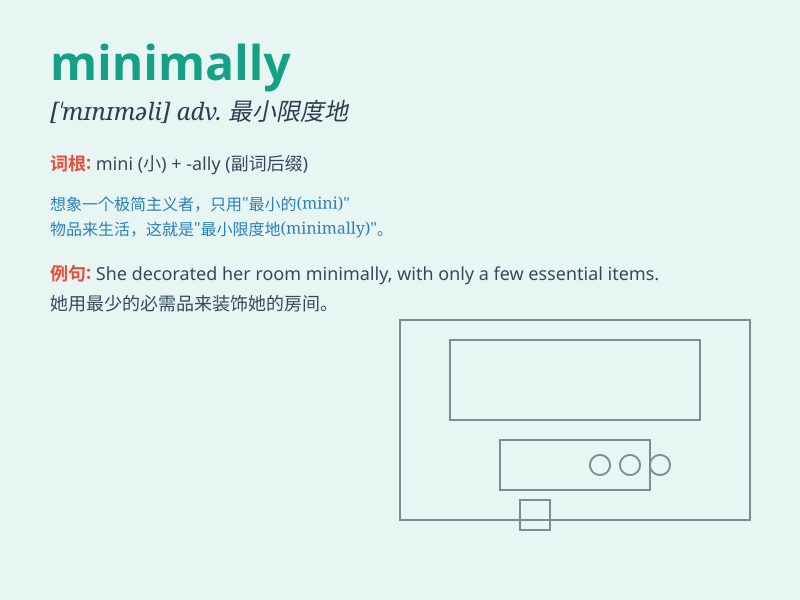

## minimally

**英音:** _[ˈmɪnɪmli]_ **美音:** _[ˈmɪnəməli]_

**译义:** *adv.最低限度地,最低程度地*

### 短语

+ **minimally invasive:** _微创的_

+ **minimally sufficient:** _最低限度足够的_

+ **minimally acceptable:** _最低可接受的_

+ **minimally affected:** _受影响最小的_

+ **minimally equipped:** _装备最低限度的_

### 例句

#### 例句1

> **The project was minimally affected by the delay.**

**中文翻译:** 这个项目受延误的影响极小。

**单词释义:** 极小地；最低限度地

#### 例句2

> **She was minimally dressed for the cold weather.**

**中文翻译:** 她穿得太少，对这种寒冷天气来说。

**单词释义:** 最少地；最低程度地

#### 例句3

> **The new policy will minimally change our daily routine.**

**中文翻译:** 新政策对我们的日常生活改变极小。

**单词释义:** 最低程度地；最少地

### 背诵小故事

> A little mouse was exploring a big maze. It moved minimally, just a
few steps at a time, afraid to get lost. But with its minimally cautious
steps, it finally found the exit.

**一只小老鼠正在探索一个大迷宫。它移动得极少，每次只走几步，害怕迷路。但凭借着它极其谨慎的小步移动，它最终找到了出口。**

### 图义

