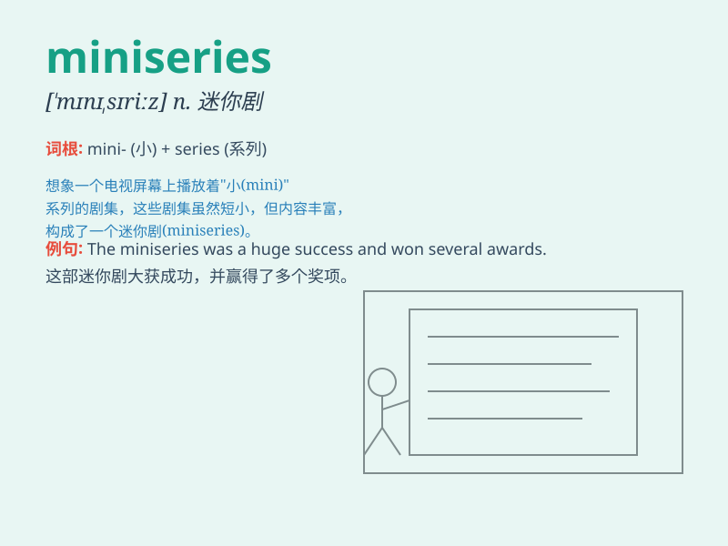

## miniseries

**英音:** _[ˈmɪnɪˌsɪəriːz]_ **美音:** _[ˈmɪnɪˌsɪriz]_

**译义:** *n.
迷你剧（指电视或广播中播放的短篇连续剧，通常由几集组成）*

### 短语

+ **TV miniseries:** _电视迷你剧_

+ **historical miniseries:** _历史迷你剧_

+ **drama miniseries:** _剧情迷你剧_

+ **crime miniseries:** _犯罪迷你剧_

+ **romantic miniseries:** _浪漫迷你剧_

### 例句

#### 例句1

> **The new miniseries on Netflix has received rave reviews.**

**中文翻译:** 网飞新出的迷你剧获得了好评如潮。

**单词释义:** 迷你剧

#### 例句2

> **She starred in a popular miniseries last year.**

**中文翻译:** 她去年主演了一部受欢迎的迷你剧。

**单词释义:** 迷你剧

#### 例句3

> **This miniseries tells the story of a family\'s struggles and
triumphs.**

**中文翻译:** 这部迷你剧讲述了一个家庭的奋斗与胜利。

**单词释义:** 迷你剧

### 背诵小故事

>
想象一下，有个小镇举办了一场特别的活动，展示了一系列迷你的戏剧，这些迷你戏剧就像一个个小世界。这种由多个迷你剧集组成的系列，就是\'miniseries\'，就像这个独特的小镇活动一样令人难忘。

**想象一个关于迷你剧集组成的系列的故事来帮助记忆\'miniseries\'这个单词**

### 图义

