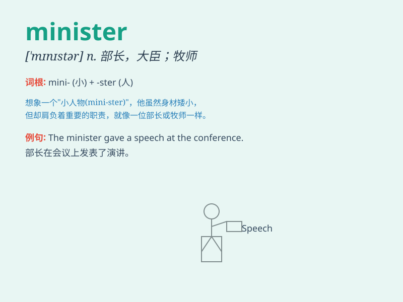

## minister

**英音:** _[\'mɪnɪstə]_ **美音:** _[\'mɪnɪstɚ]_

**译义:** *n.部长,大臣*

### 短语

+ **prime minister:** _首相；总理_

+ **foreign minister:** _外交部长_

+ **cabinet minister:** _内阁部长_

+ **minister of state:** _国务大臣_

+ **minister of religion:** _宗教部长；神职人员_

### 例句

#### 例句1

> **The minister delivered an important speech at the conference.**

**中文翻译:** 部长在会上发表重要讲话。

**单词释义:** 部长

#### 例句2

> **The prime minister is responsible for the country\'s economy.**

**中文翻译:** 总理负责国家的经济。

**单词释义:** 首相

#### 例句3

> **The foreign minister held talks with representatives from other
countries.**

**中文翻译:** 外长与各国代表举行会谈。

**单词释义:** 外交部长

### 背诵小故事

>
想象一个小国家，国王很忙。这时有一位叫Minister的大臣，他每天都早早地来到宫殿，为国王出谋划策，处理各种事务，深受国王信任。

**想象一个小国家里有一位叫大臣的人，他每天为国王工作，帮助处理事务，以此来辅助记住minister（大臣；部长）这个单词。**

### 图义

