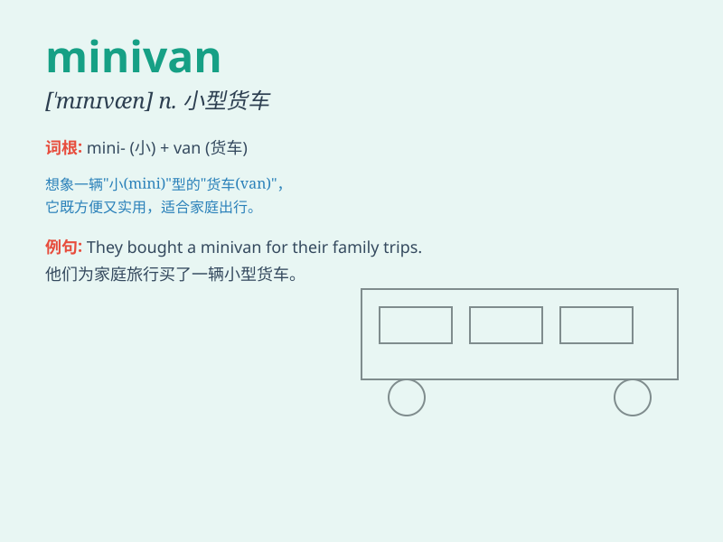

## minivan

**英音:** _[\'mɪnɪvæn]_ **美音:** _[\'mɪnɪvæn]_

**译义:** *n.小型货车*

### 短语

+ **family minivan:** _家用小型厢式车_

+ **passenger minivan:** _客运小型厢式车_

+ **commercial minivan:** _商用小型厢式车_

+ **minivan rental:** _小型厢式车租赁_

+ **minivan driver:** _小型厢式车司机_

### 例句

#### 例句1

> **The family went on a road trip in their minivan.**

**中文翻译:** 一家人开着小型货车去公路旅行。

**单词释义:** 小型货车

#### 例句2

> **The minivan was filled with groceries.**

**中文翻译:** 小型货车装满了杂货。

**单词释义:** 小型货车

#### 例句3

> **He drives a minivan to pick up the kids from school every
day.**

**中文翻译:** 他每天开着一辆小货车去学校接孩子们。

**单词释义:** 小型货车

### 背诵小故事

> One day, a family was going on a trip. They needed a vehicle that was
not too big but could fit everyone. So, they chose a minivan. It was
just right for their journey, with enough space and comfort.

**有一天，一家人要去旅行。他们需要一辆不太大但能容纳所有人的车。于是，他们选择了一辆小型厢式车。它正好适合他们的旅程，有足够的空间和舒适性。**

### 图义

