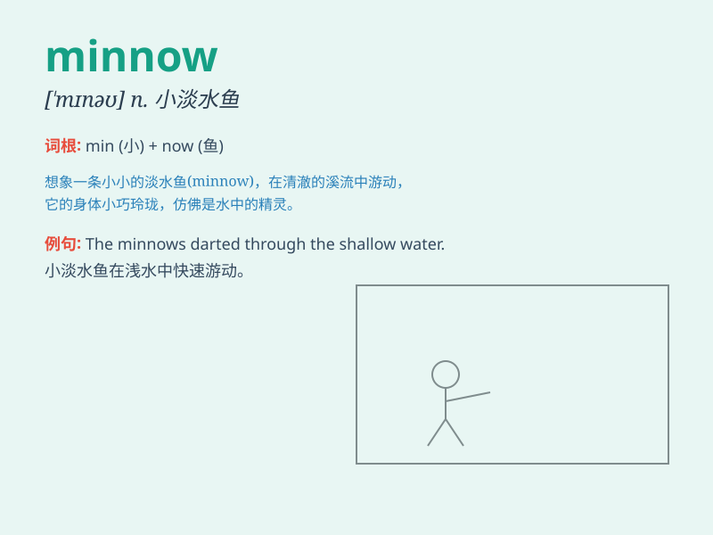

## minnow

**英音:** _[\'mɪnəʊ]_ **美音:** _[\'mɪno]_

**译义:** *n.鲤科小鱼*

### 短语

+ **big minnow:** _大的米诺鱼_

+ **small minnow:** _小的米诺鱼_

+ **colorful minnow:** _色彩斑斓的米诺鱼_

+ **active minnow:** _活跃的米诺鱼_

+ **shy minnow:** _害羞的米诺鱼_

### 例句

#### 例句1

> **The minnow swam gracefully in the shallow stream.**

**中文翻译:** 米诺鱼在浅溪里优雅地游着。

**单词释义:** 小鱼

#### 例句2

> **He used to catch minnows as a child.**

**中文翻译:** 他小时候经常捉小鱼。

**单词释义:** 小鱼

#### 例句3

> **The pond was filled with various kinds of minnows.**

**中文翻译:** 池塘里养满了各种各样的小鱼。

**单词释义:** 小鱼

### 背诵小故事

> A little fish named Minnow was always ignored by the big fish in the
pond. But Minnow was brave and learned many skills. Finally, it became a
strong and confident fish. Remember, Minnow is a small freshwater fish.

**一条叫米诺的小鱼总是被池塘里的大鱼忽视。但米诺很勇敢，学会了很多技能。最后，它变成了一条强壮且自信的鱼。记住，minnow
是指鲦鱼，一种小型淡水鱼。**

### 图义

