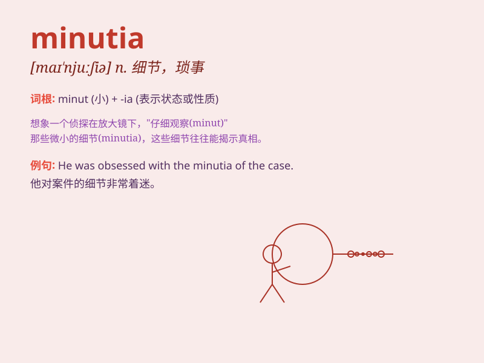

## minutia

**英音:** _[mɪ\'njuːʃɪə]_ **美音:** _[maɪ\'njʊʃɪr]_

**译义:** *n.细节,琐事,细目*

### 短语

+ **minute details:** _微小的细节_

+ **attend to minutiae:** _关注细枝末节_

+ **get bogged down in minutiae:** _陷入细枝末节之中_

+ **ignore the minutiae:** _忽略细节_

+ **focus on minutiae:** _专注于细节_

### 例句

#### 例句1

> **She pays attention to every minutia of her appearance.**

**中文翻译:** 她注重自己外表的每一个细节。

**单词释义:** 细节；琐事

#### 例句2

> **The lawyer was meticulous in examining the minutia of the
contract.**

**中文翻译:** 律师仔细审查了合同的细节。

**单词释义:** 细微之处

#### 例句3

> **He got lost in the minutia of the project and lost sight of the
overall goal.**

**中文翻译:** 他迷失在项目的细节中而忽视了总体目标。

**单词释义:** 琐事；细微末节

### 背诵小故事

> A detective was solving a case and paid great attention to every
minutia. Even a tiny scratch on the wall or a misplaced object was
crucial. Finally, he caught the criminal based on these small details.

**一位侦探在破案时，对每一个细节都极为关注。哪怕墙上的一道小划痕，或是一个放错位置的物品都至关重要。最终，他依据这些细微之处抓住了罪犯。**

### 图义

