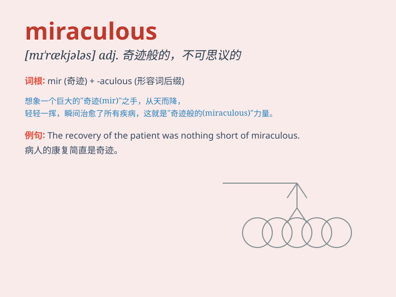

## miraculous

**英音:** _[mɪ\'rækjʊləs]_ **美音:** _[mɪ\'rækjələs]_

**译义:** *adj.奇迹的,不可思议的*

### 短语

+ **miraculous cure:** _神奇的疗法_

+ **miraculous escape:** _奇迹般的逃脱_

+ **miraculous recovery:** _奇迹般的康复_

+ **miraculous transformation:** _神奇的转变_

+ **miraculous event:** _神奇的事件_

### 例句

#### 例句1

> **The recovery of the patient was miraculous.**

**中文翻译:** 病人的康复是奇迹。

**单词释义:** 奇迹般的

#### 例句2

> **It was a miraculous escape from the burning building.**

**中文翻译:** 这是从着火的大楼里奇迹般的逃生。

**单词释义:** 奇迹般的

#### 例句3

> **The team achieved a miraculous victory in the final game.**

**中文翻译:** 球队在最后的比赛中取得了奇迹般的胜利。

**单词释义:** 奇迹般的

### 背诵小故事

> A poor man was lost in the forest. Just when he felt hopeless, a
miraculous light guided him out. It was like a magical force saving him.
He was so grateful for this unexpected and wonderful help.

**一个穷人在森林里迷路了。就在他感到绝望的时候，一道神奇的光引导他走了出来。就像是一股神奇的力量拯救了他。他非常感激这意想不到的奇妙帮助。**

### 图义

