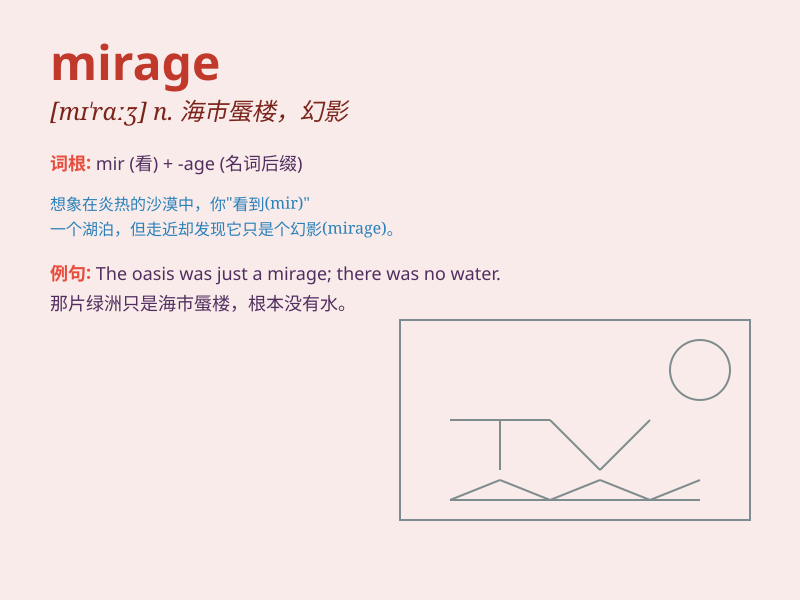

## mirage

**英音:** _[\'mɪrɑːʒ; mɪ\'rɑːʒ]_ **美音:** _[mə\'rɑʒ]_

**译义:** *n.海市蜃楼,雾气,幻想,妄想*

### 短语

+ **optical mirage:** _光学幻影_

+ **desert mirage:** _沙漠幻影_

+ **mirage effect:** _幻影效应_

+ **create a mirage:** _制造幻影_

+ **see a mirage:** _看见幻影_

### 例句

#### 例句1

> **The oasis in the desert was just a mirage.**

**中文翻译:** 沙漠中的绿洲只是海市蜃楼。

**单词释义:** 幻影；海市蜃楼

#### 例句2

> **His hope of success turned out to be a mirage.**

**中文翻译:** 他成功的希望最终化为泡影。

**单词释义:** 幻想；妄想

#### 例句3

> **The promise of quick wealth is often a mirage.**

**中文翻译:** 快速致富的承诺往往是海市蜃楼。

**单词释义:** 虚幻的景象；错觉

### 背诵小故事

> In the hot desert, a thirsty traveler saw what seemed like a clear
lake ahead - a mirage. But as he got closer, it vanished. It was just an
illusion caused by the heat. Remember, a mirage is a false image.

**在炎热的沙漠中，一位口渴的旅行者看到前方似乎有一个清澈的湖泊------这是海市蜃楼。但当他走近时，它消失了。这只是由炎热造成的幻觉。记住，mirage
就是虚幻的景象。**

### 图义

