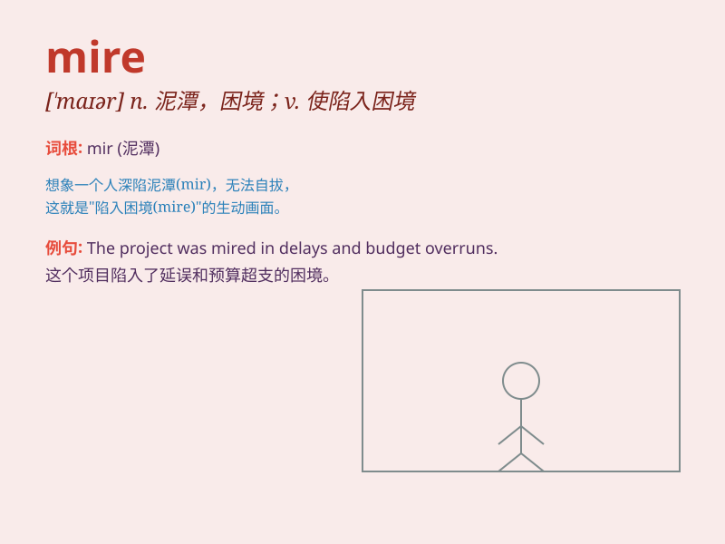

## mire

**英音:** _[maɪə]_ **美音:** _[\'maɪɚ]_

**译义:** *n.泥潭v.陷入*

### 短语

+ **be stuck in the mire:** _陷入泥潭_

+ **mire of debt:** _债务的泥潭_

+ **mire oneself in:** _使自己陷入_

+ **deep mire:** _深深的泥潭_

+ **boggy mire:** _沼泽泥潭_

### 例句

#### 例句1

> **The car got stuck in the mire and couldn\'t move.**

**中文翻译:** 车子陷入了泥潭，动弹不得。

**单词释义:** 泥潭；泥沼

#### 例句2

> **He was mired in debt after his business failed.**

**中文翻译:** 生意失败后，他负债累累。

**单词释义:** 使陷入困境

#### 例句3

> **The country\'s economy is mired in recession.**

**中文翻译:** 该国经济陷入衰退。

**单词释义:** 陷入；深陷

### 背诵小故事

> A traveler was walking in the forest and suddenly got stuck in the
mire. He struggled hard but couldn\'t move. Just when he was about to
give up, a kind woodcutter came and pulled him out.

**一位旅行者在森林里行走，突然陷入了泥潭。他拼命挣扎却无法动弹。就在他快要放弃的时候，一位好心的樵夫过来把他拉了出来。**

### 图义

