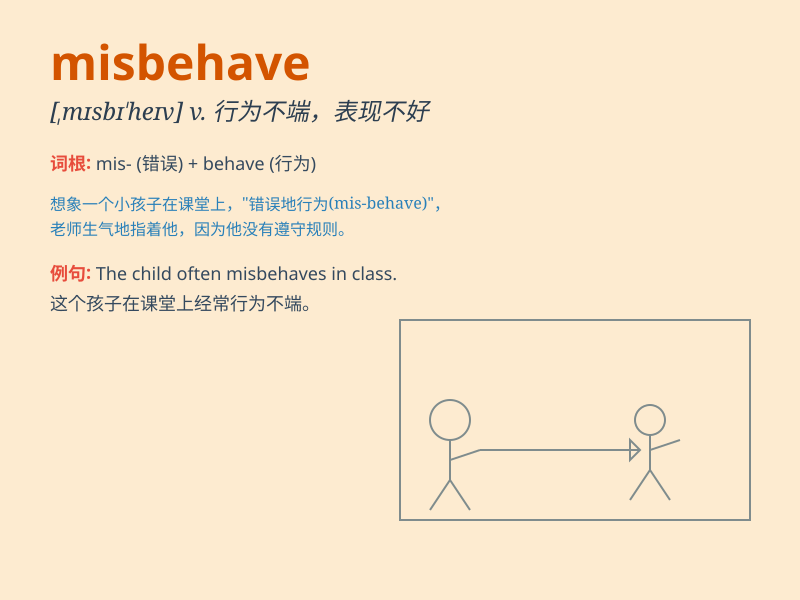

## misbehave

**英音:** _[mɪsbɪ\'heɪv]_ **美音:** _[,mɪsbɪ\'hev]_

**译义:** *v.(使)行为无礼貌,(使)行为不端*

### 短语

+ **misbehave oneself:** _行为不端；举止不当_

+ **misbehave in class:** _在课堂上表现不好_

+ **misbehave at school:** _在学校行为不端_

+ **misbehave with friends:** _和朋友相处时行为不当_

+ **constantly misbehave:** _经常行为不端_

### 例句

#### 例句1

> **The children misbehaved at the party and made a lot of noise.**

**中文翻译:** 孩子们在聚会上行为不端，发出很大的噪音。

**单词释义:** 表现不好，行为不端

#### 例句2

> **If you misbehave in class, you will be punished.**

**中文翻译:** 如果你在课堂上表现不佳，你将会受到惩罚。

**单词释义:** 行为不端，举止不当

#### 例句3

> **He misbehaved during the meeting and was criticized by the
boss.**

**中文翻译:** 他在会议上表现不佳，受到了老板的批评。

**单词释义:** 表现不佳，行为失当

### 背诵小故事

> Once upon a time, there was a naughty monkey in the zoo. It climbed
the trees when it wasn\'t supposed to and threw bananas at visitors.
This monkey misbehaved and caused a lot of trouble.

**从前，动物园里有一只顽皮的猴子。它在不该爬树的时候爬树，还向游客扔香蕉。这只猴子行为不端，惹了很多麻烦。**

### 图义

