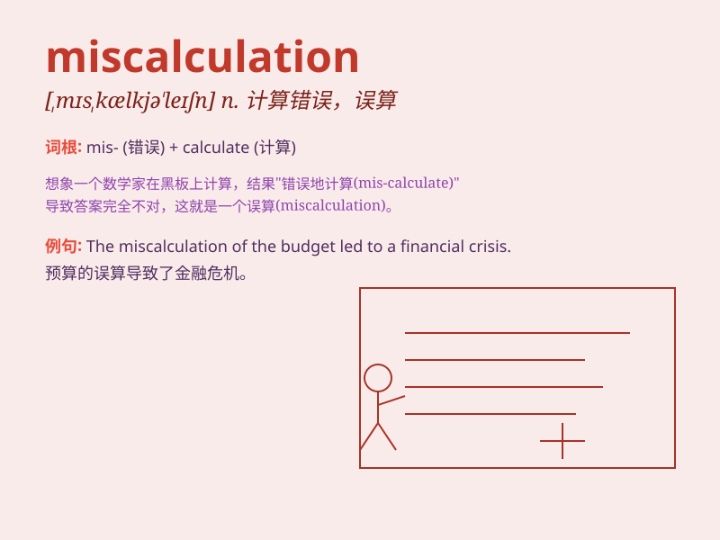

## miscalculation

**英音:** _[ˌmɪskælkju\'leɪʃn]_ **美音:**
_[ˌmɪskælkju\'leɪʃn]_

**译义:** *n.误算,估错*

### 短语

+ **make a miscalculation:** _算错；误算_

+ **serious miscalculation:** _严重的误算_

+ **cost miscalculation:** _成本误算_

+ **risk miscalculation:** _风险误判_

+ **strategic miscalculation:** _战略误判_

### 例句

#### 例句1

> **The miscalculation of the budget led to serious financial
problems for the company.**

**中文翻译:** 预算计算错误导致公司出现严重的财务问题。

**单词释义:** 误算；算错

#### 例句2

> **His miscalculation about the weather made him unprepared for the
sudden storm.**

**中文翻译:** 他对天气的错误估计使他对突如其来的暴风雨毫无准备。

**单词释义:** 错误估计

#### 例句3

> **The miscalculation in the math exam cost him several points.**

**中文翻译:** 数学考试的算错让他扣了几分。

**单词释义:** 计算错误

### 背诵小故事

> One day, a scientist made a miscalculation in his experiment. He
thought the chemical reaction would happen in a certain way, but it
didn\'t. This miscalculation led to unexpected results and taught him to
be more careful in the future.

**有一天，一位科学家在他的实验中算错了。他以为化学反应会以某种方式发生，但事实并非如此。这次的错误计算导致了意想不到的结果，并让他以后更加小心。**

### 图义

