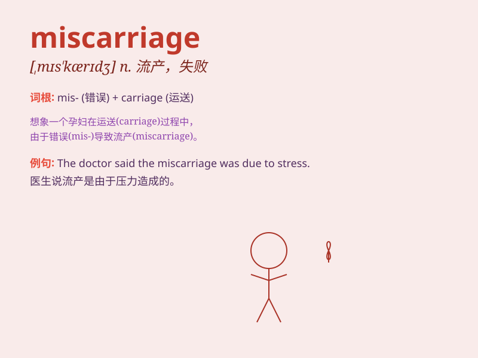

## miscarriage

**英音:** _[mɪs\'kærɪdʒ; \'mɪskærɪdʒ]_ **美音:**
_[\'mɪskærɪdʒ]_

**译义:** *n.失败,误送,[医]流产*

### 短语

+ **risk of miscarriage:** _流产的风险_

+ **prevent miscarriage:** _预防流产_

+ **suffer a miscarriage:** _遭受流产_

+ **late miscarriage:** _晚期流产_

+ **recurrent miscarriage:** _反复流产_

### 例句

#### 例句1

> **The stress of her job may have contributed to the
miscarriage.**

**中文翻译:** 她的工作压力可能是导致流产的原因之一。

**单词释义:** 流产

#### 例句2

> **She suffered a miscarriage in the early months of pregnancy.**

**中文翻译:** 她在怀孕的最初几个月流产了。

**单词释义:** 流产

#### 例句3

> **The doctor is investigating the cause of the miscarriage.**

**中文翻译:** 医生正在调查流产的原因。

**单词释义:** 流产

### 背诵小故事

> A woman was very sad because of a miscarriage. She had expected a new
life but lost it. This painful experience made the word\'miscarriage\'
deeply engraved in her mind.

**一位女士因流产非常伤心。她曾期待新生命的到来却失去了。这个痛苦的经历让"miscarriage（流产）"这个词深深地刻在了她的脑海里。**

### 图义

