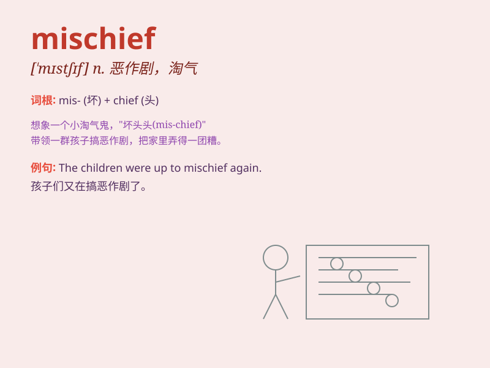

## mischief

**英音:** _[\'mɪstʃɪf]_ **美音:** _[\'mɪstʃɪf]_

**译义:** *n.伤害,危害,故障,恶作剧,淘气,调皮的人,损害*

### 短语

+ **make mischief:** _挑拨离间；搬弄是非_

+ **up to mischief:** _打算胡闹；捣乱_

+ **get into mischief:** _陷入恶作剧；惹麻烦_

+ **mischief-making:** _制造麻烦；搬弄是非_

+ **mischief managed:**
_（用于表示已成功解决问题或避免了麻烦）麻烦解决_

### 例句

#### 例句1

> **The children always get up to mischief when their parents are
out.**

**中文翻译:** 当父母外出时，孩子们总是会调皮捣蛋。

**单词释义:** 恶作剧；捣蛋；顽皮

#### 例句2

> **He caused a lot of mischief at school.**

**中文翻译:** 他在学校造成了很多恶作剧。

**单词释义:** 麻烦；胡闹

#### 例句3

> **There\'s a glint of mischief in her eyes.**

**中文翻译:** 她的眼里闪过一丝狡黠的光芒。

**单词释义:** 顽皮；淘气

### 背诵小故事

> A naughty monkey was always up to mischief in the zoo. It would steal
visitors\' hats and play tricks on other animals. One day, it got itself
into trouble but learned its lesson. \'Mischief\' means naughty or
harmful behavior.

**一只顽皮的猴子在动物园里总是调皮捣蛋。它会偷游客的帽子，还捉弄其他动物。有一天，它给自己惹了麻烦，但也得到了教训。\'mischief\'意思是顽皮的或有害的行为。**

### 图义

