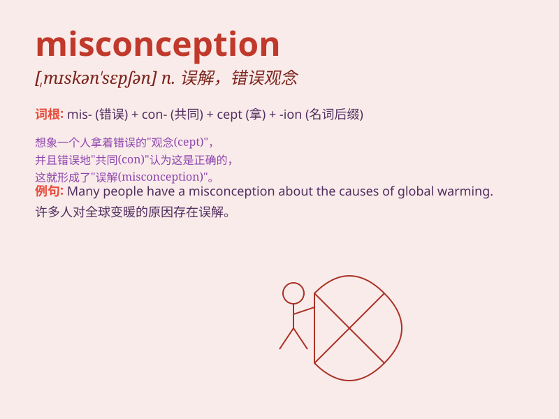

## misconception

**英音:** _[mɪskən\'sepʃ(ə)n]_ **美音:**
_[\'mɪskən\'sɛpʃən]_

**译义:** *n.误解*

### 短语

+ **clear up a misconception:** _消除一个误解_

+ **have a misconception:** _有一个误解_

+ **correct a misconception:** _纠正一个误解_

+ **dispense with a misconception:** _摒弃一个误解_

+ **be based on a misconception:** _基于一个误解_

### 例句

#### 例句1

> **There is a common misconception that all snakes are
dangerous.**

**中文翻译:** 人们普遍错误地认为所有蛇都是危险的。

**单词释义:** 错误观念；误解

#### 例句2

> **His misconception about the job led to his failure to perform
well.**

**中文翻译:** 他对这份工作的误解导致他表现不佳。

**单词释义:** 误解；错误想法

#### 例句3

> **We need to correct the misconception that studying is boring.**

**中文翻译:** 我们需要纠正"学习很无聊"的错误观念。

**单词释义:** 错误观念；错误的想法

### 背诵小故事

> A student always thought that all birds could fly. But when he saw a
penguin, he realized it was a misconception. Not all birds have the
ability to fly. This made him understand the meaning of misconception.

**一个学生一直认为所有的鸟都会飞。但当他看到企鹅时，他意识到这是一个错误的观念。并非所有的鸟都有飞行的能力。这让他明白了misconception（错误观念）的意思。**

### 图义

