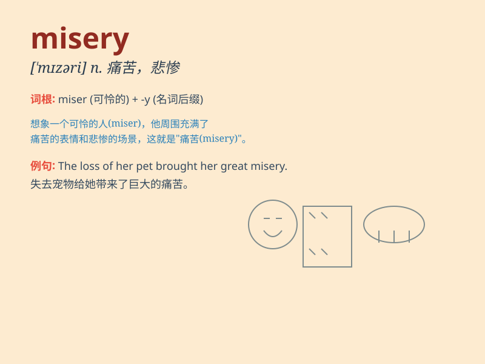

## misery

**英音:** _[ˈmɪzəri]_ **美音:** _[ˈmɪzəri]_

**译义:**
*n.痛苦，苦恼；悲惨的生活，困苦的境遇；令人不快的人（或事物）*

### 短语

+ **endure misery:** _忍受痛苦_

+ **relieve misery:** _减轻痛苦_

+ **suffer from misery:** _遭受痛苦_

+ **be in misery:** _处于痛苦之中_

+ **escape from misery:** _逃离痛苦_

### 例句

#### 例句1

> **The war brought nothing but misery and destruction.**

**中文翻译:** 这场战争带来的只有痛苦和破坏。

**单词释义:** 痛苦

#### 例句2

> **She was in a state of deep misery after the divorce.**

**中文翻译:** 离婚后她处于极度痛苦的状态。

**单词释义:** 痛苦；悲惨

#### 例句3

> **The poor man\'s life was full of misery and hardship.**

**中文翻译:** 这个穷人的生活充满了苦难和痛苦。

**单词释义:** 苦难；不幸

### 背诵小故事

> A poor man was always in misery. He had no job, no money, and lived
in a small, cold room. One day, he found a way to change his life and
finally escaped from this state of misery.

**一个可怜的男人总是处于痛苦之中。他没有工作，没有钱，住在一个又小又冷的房间里。有一天，他找到了改变生活的方法，最终摆脱了这种痛苦的状态。**

### 图义

