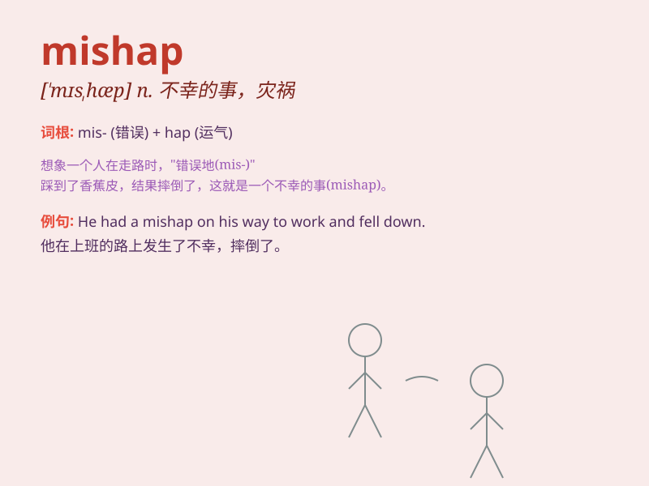

## mishap

**英音:** _[\'mɪshæp]_ **美音:** _[\'mɪshæp]_

**译义:** *n.灾祸*

### 短语

+ **minor mishap:** _小事故_

+ **avoid mishap:** _避免不幸_

+ **suffer a mishap:** _遭受不幸_

+ **unexpected mishap:** _意外的灾祸_

+ **prevent mishap:** _预防灾祸_

### 例句

#### 例句1

> **She had a mishap while skiing and broke her leg.**

**中文翻译:** 她在滑雪时出了事故，摔断了腿。

**单词释义:** 意外事故；不幸

#### 例句2

> **A series of mishaps prevented the project from being completed on
time.**

**中文翻译:** 一系列事故导致该项目未能按时完成。

**单词释义:** 灾祸；小事故

#### 例句3

> **He narrowly avoided a mishap on the busy road.**

**中文翻译:** 他在繁忙的道路上侥幸避免了一场事故。

**单词释义:** 不幸之事；晦气

### 背诵小故事

> One day, Tom was in a hurry to catch a train. He ran and accidentally
tripped, dropping all his luggage. This unexpected accident was a
mishap. But luckily, he still made it to the train on time.

**有一天，汤姆匆忙赶火车。他跑着跑着意外绊倒了，行李都掉了。这个意想不到的意外就是不幸之事。但幸运的是，他还是按时赶上了火车。**

### 图义

