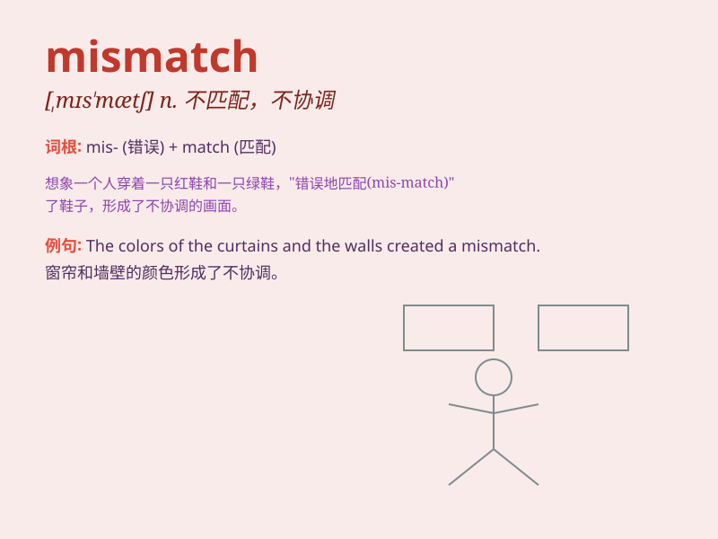

## mismatch

**英音:** _[\'mɪsmætʃ]_ **美音:** _[\'mɪsmætʃ]_

**译义:** *vt.使配错,使配合不当n.错配,失谐*

### 短语

+ **mismatch error:** _不匹配错误_

+ **mismatch between:** _在\...\...之间不匹配_

+ **genetic mismatch:** _基因不匹配_

+ **mismatch of skills:** _技能不匹配_

+ **mismatch in information:** _信息不匹配_

### 例句

#### 例句1

> **There is a mismatch between the supply and demand of the
product.**

**中文翻译:** 产品的供需之间存在不匹配。

**单词释义:** 不匹配；不协调

#### 例句2

> **The colors of your shirt and tie are a mismatch.**

**中文翻译:** 你的衬衫和领带的颜色不匹配。

**单词释义:** 不匹配；不协调

#### 例句3

> **The skills of the workers and the requirements of the job showed
a mismatch.**

**中文翻译:** 工人的技能与工作要求不匹配。

**单词释义:** 不匹配；不协调

### 背诵小故事

> There was a big game. The coach found a mismatch in the players\'
heights. The tall players were on one team, and the short ones on the
other. This imbalance made it hard to play fairly.

**有一场大型比赛。教练发现球员身高不匹配。高个子球员在一队，矮个子球员在另一队。这种不平衡让比赛很难公平进行。**

### 图义

