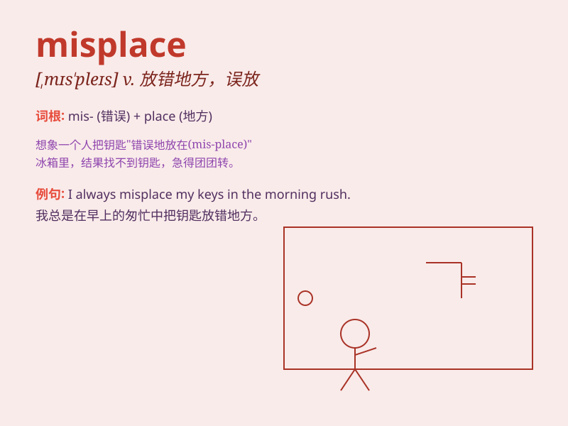

## misplace

**英音:** _[mɪs\'pleɪs]_ **美音:** _[,mɪs\'ples]_

**译义:** *vt.放错地方*

### 短语

+ **misplace trust:** _错信_

+ **misplace confidence:** _误信_

+ **misplace one\'s belongings:** _放错个人物品_

+ **misplace documents:** _放错文件_

+ **misplace keys:** _放错钥匙_

### 例句

#### 例句1

> **I seem to have misplaced my keys.**

**中文翻译:** 我好像把钥匙放错地方了。

**单词释义:** 放错地方

#### 例句2

> **She misplaced the important document and couldn\'t find it in
time.**

**中文翻译:** 她把重要文件放错地方了，没能及时找到。

**单词释义:** 放错

#### 例句3

> **Don\'t misplace your trust in the wrong people.**

**中文翻译:** 不要把你的信任误给了错误的人。

**单词释义:** 错放

### 背诵小故事

> One day, Tom misplace his favorite toy car. He looked everywhere but
couldn\'t find it. Finally, he found it under the sofa. It taught him to
be more careful with his things.

**有一天，汤姆放错了他最喜欢的玩具汽车。他到处找但都找不到。最后，他在沙发下面找到了。这教会他要更小心地对待自己的东西。**

### 图义

