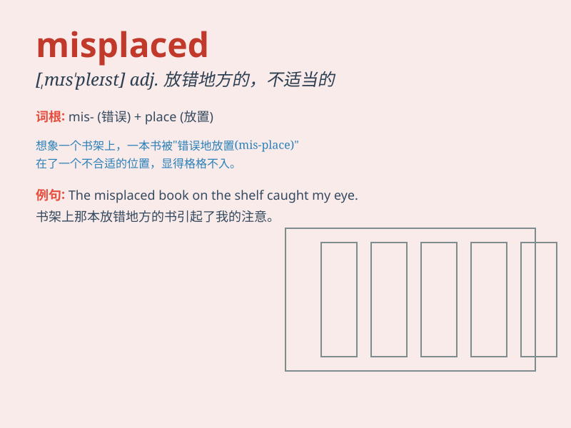

## misplaced

**英音:** _[ˌmɪsˈpleɪst]_ **美音:** _[ˌmɪsˈpleɪst]_

**译义:** *adj. 放错地方的；不合时宜的；v. 放错地方；错给*

### 短语

+ **misplaced confidence:** _错置的信任_

+ **misplaced optimism:** _不当的乐观_

+ **misplaced affection:** _错付的感情_

+ **misplaced emphasis:** _错误的重点_

+ **misplaced loyalty:** _误用的忠诚_

### 例句

#### 例句1

> **His confidence was misplaced.**

**中文翻译:** 他的自信用错了地方。

**单词释义:** 放错地方的；不合时宜的

#### 例句2

> **The misplaced emphasis on speed led to errors.**

**中文翻译:** 对速度的不当强调导致了错误。

**单词释义:** 错误放置的；不恰当的

#### 例句3

> **Her misplaced trust in him proved costly.**

**中文翻译:** 她对他错误的信任让她付出了沉重的代价。

**单词释义:** 错置的；不适当的

### 背诵小故事

> A boy misplaced his favorite toy car. He looked everywhere but
couldn\'t find it. Later, he found it in a wrong box. Misplaced means
put something in the wrong place.

**一个男孩把他最喜欢的玩具车放错了地方。他到处找但都找不到。后来，他在一个错误的盒子里找到了。misplaced
意思是把某物放错地方。**

### 图义

