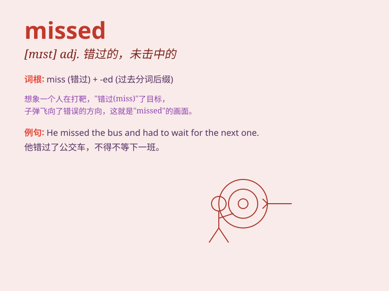

## missed

**英音:** _[mɪst]_ **美音:** _[mɪst]_

**译义:** *miss
的过去式和过去分词，意为：错过；未击中；未达到；未见到；未听到；未觉察；不理解；不懂；思念；怀念*

### 短语

+ **missed opportunity:** _错失的机会_

+ **missed call:** _未接来电_

+ **missed shot:** _射偏；投篮未中_

+ **missed deadline:** _错过截止日期_

+ **missed connection:** _错过的衔接；误了的联运_

### 例句

#### 例句1

> **I missed the bus this morning and was late for work.**

**中文翻译:** 我今天早上错过了公交车，上班迟到了。

**单词释义:** 错过

#### 例句2

> **She missed her chance to go to the concert.**

**中文翻译:** 她错过了去音乐会的机会。

**单词释义:** 错过

#### 例句3

> **He realized he missed his family very much when he was
abroad.**

**中文翻译:** 当他在国外时，他意识到他非常想念他的家人。

**单词释义:** 想念

### 背诵小故事

> One day, Tom was waiting for his friend at the station. But his
friend missed the train and Tom missed meeting him. Tom was very sad.

**一天，汤姆在车站等他的朋友。但他的朋友错过了火车，汤姆也错过了和他见面。汤姆非常伤心。**

### 图义

