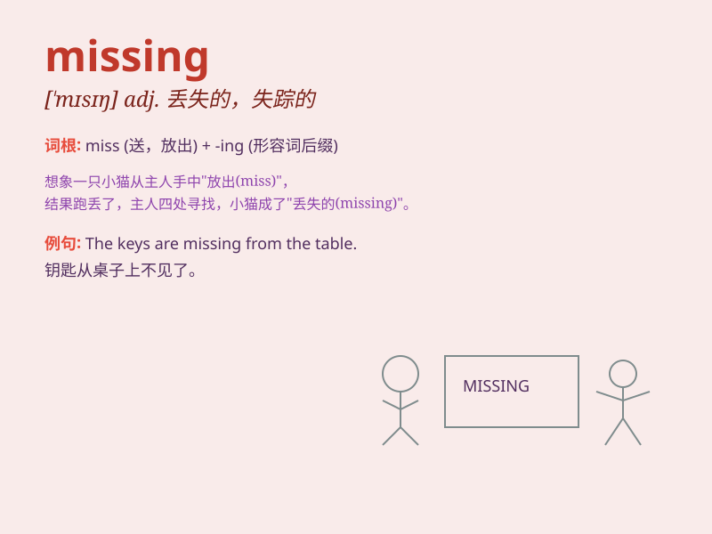

## missing

**英音:** _[\'mɪsɪŋ]_ **美音:** _[\'mɪsɪŋ]_

**译义:** *adj.不见的,缺少的*

### 短语

+ **missing person:** _失踪人员_

+ **missing link:** _缺失的环节_

+ **go missing:** _失踪；不见_

+ **missing piece:** _缺失的部分_

+ **missing information:** _缺失的信息_

### 例句

#### 例句1

> **The police are looking for the missing child.**

**中文翻译:** 警察正在寻找失踪的孩子。

**单词释义:** 失踪的

#### 例句2

> **There is a page missing from this book.**

**中文翻译:** 这本书少了一页。

**单词释义:** 缺少的

#### 例句3

> **She has been feeling a little missing you lately.**

**中文翻译:** 她最近有点想念你。

**单词释义:** 想念

### 背诵小故事

> One day, Tom found his favorite toy car was missing. He looked
everywhere but couldn\'t find it. Later, he discovered his little sister
had hidden it under the bed. Poor Tom was so worried before finding it.

**有一天，汤姆发现他最喜欢的玩具车不见了。他到处找都找不到。后来，他发现是他的小妹妹把它藏在了床底下。在找到之前，可怜的汤姆好担心。**

### 图义

