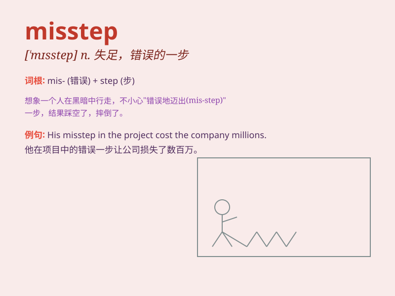

## misstep

**英音:** _[mɪs\'step]_ **美音:** _[,mɪs\'stɛp]_

**译义:** *n.失足*

### 短语

+ **commit a misstep:** _犯了一个错误_

+ **avoid misstep:** _避免错误_

+ **recognize a misstep:** _认识到一个错误_

+ **correct a misstep:** _纠正一个错误_

+ **learn from a misstep:** _从错误中吸取教训_

### 例句

#### 例句1

> **His misstep in the business deal cost the company a lot of
money.**

**中文翻译:** 他在商业交易中的失误让公司损失了很多钱。

**单词释义:** 失误；错误的步骤

#### 例句2

> **She realized her misstep when she saw the disappointed look on
her friend\'s face.**

**中文翻译:** 当她看到朋友脸上失望的表情时，她意识到了自己的过错。

**单词释义:** 过错；失策

#### 例句3

> **One misstep in the dance routine and the performance could be
ruined.**

**中文翻译:** 舞蹈动作中的一个失误就可能毁掉整个表演。

**单词释义:** 差错；失足

### 背诵小故事

> One day, a climber was on a difficult mountain path. A misstep made
him lose his balance and almost fall. Luckily, he caught a branch in
time. This misstep taught him to be more careful.

**有一天，一位登山者在艰难的山路上。一个失足让他失去平衡，差点摔倒。幸运的是，他及时抓住了一根树枝。这次失足教会他要更加小心。**

### 图义

