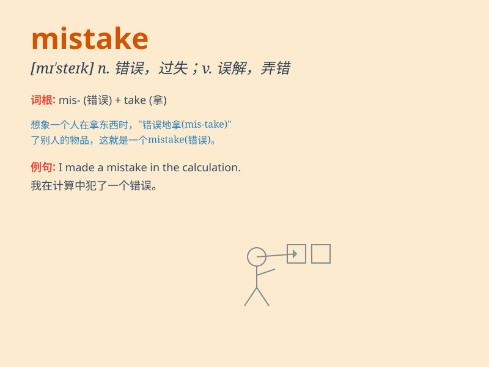

## mistake

**英音:** _[mɪˈsteɪk]_ **美音:** _[mɪˈsteɪk]_

**译义:** *n.错误；误会；过失 vt.弄错；误解 vi.弄错；误解*

### 短语

+ **make a mistake:** _犯错误_

+ **by mistake:** _错误地；无意地_

+ **mistake\...for\...:** _把......错认为......_

+ **correct a mistake:** _改正错误_

+ **admit a mistake:** _承认错误_

### 例句

#### 例句1

> **I made a mistake in the exam.**

**中文翻译:** 我在考试中犯了一个错误。

**单词释义:** 错误

#### 例句2

> **It was a big mistake to trust him.**

**中文翻译:** 信任他是个大错误。

**单词释义:** 错误

#### 例句3

> **She realized her mistake and apologized.**

**中文翻译:** 她意识到自己的错误并道歉了。

**单词释义:** 错误

### 背诵小故事

> One day, Tom was supposed to meet his friend at the park. But he went
to the zoo by mistake. His friend was very angry. Tom realized his
mistake and apologized sincerely.

**一天，汤姆本该在公园见他的朋友。但他错去了动物园。他的朋友非常生气。汤姆意识到了自己的错误并真诚地道了歉。**

### 图义

