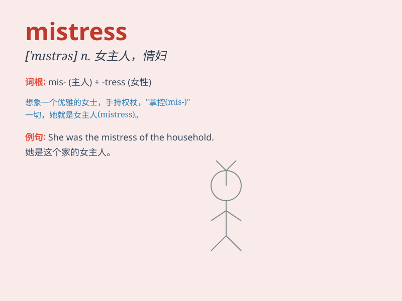

## mistress

**英音:** _[\'mɪstrɪs]_ **美音:** _[\'mɪstrəs]_

**译义:** *n.主妇,女主人,女能人,情妇*

### 短语

+ **house mistress:** _女管家_

+ **school mistress:** _女教师_

+ **mistress of ceremonies:** _女主持人；女司仪_

+ **mistress of the house:** _主妇；女主人_

+ **mistress of one\'s fate:** _自己命运的主宰者_

### 例句

#### 例句1

> **She was the mistress of the house, ruling it with an iron
fist.**

**中文翻译:** 她是这所房子的女主人，以铁腕统治着它。

**单词释义:** 女主人

#### 例句2

> **The king\'s mistress enjoyed great privileges at court.**

**中文翻译:** 国王的情妇在宫廷里享有很大的特权。

**单词释义:** 情妇

#### 例句3

> **The mistress of ceremonies introduced the speakers one by
one.**

**中文翻译:** 典礼的女主持人一个接一个地介绍发言人。

**单词释义:** 女主持人

### 背诵小故事

> A young man fell in love with a mysterious woman. But he later
discovered she was the mistress of a rich man. He was heartbroken.
Remember, \'mistress\' means a woman having an extramarital relationship
with a married man.

**一个年轻男子爱上了一位神秘女子。但后来他发现她是一个有钱人的情妇。他心碎了。记住，\'mistress\'意思是情妇，与已婚男人有婚外情的女人。**

### 图义

