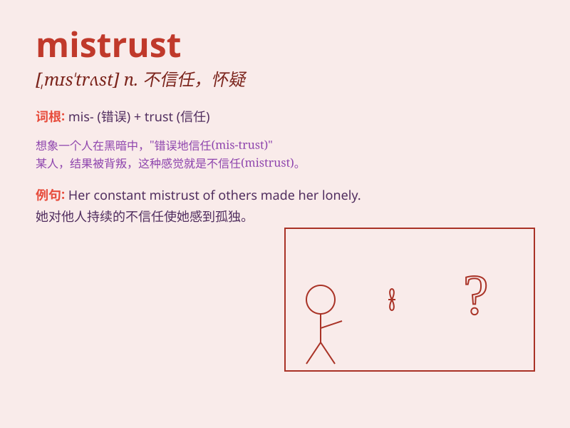

## mistrust

**英音:** _[mɪs\'trʌst]_ **美音:** _[,mɪs\'trʌst]_

**译义:** *n.不信任,猜疑v.不信任,猜疑*

### 短语

+ **mistrust of:** _对\...\...的不信任_

+ **deep mistrust:** _深深的不信任_

+ **general mistrust:** _普遍的不信任_

+ **mutual mistrust:** _相互不信任_

+ **have mistrust:** _有不信任_

### 例句

#### 例句1

> **I mistrust his motives for helping us.**

**中文翻译:** 我怀疑他帮助我们的动机。

**单词释义:** 怀疑；不信任

#### 例句2

> **Her constant lies have led to my mistrust of everything she
says.**

**中文翻译:** 她总是说谎，导致我对她所说的一切都不信任。

**单词释义:** 不信任；猜疑

#### 例句3

> **We should not mistrust him just because of one mistake.**

**中文翻译:** 我们不应该仅仅因为一个错误就不信任他。

**单词释义:** 不信任；怀疑

### 背诵小故事

> Once upon a time, Tom always suspected others\' motives, showing a
lot of mistrust. One day, he realized his mistake and started to trust
people. From then on, his life became happier.

**从前，汤姆总是怀疑别人的动机，表现出很多的不信任。有一天，他意识到了自己的错误并开始信任别人。从那以后，他的生活变得更快乐了。**

### 图义

