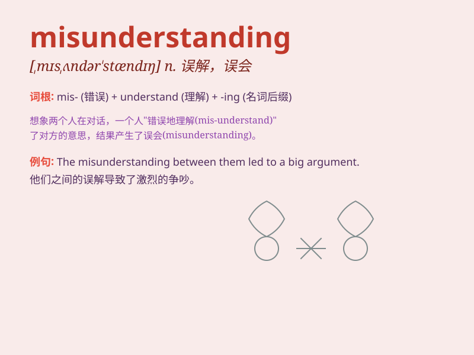

## misunderstanding

**英音:** _[,mɪsʌndə\'stændɪŋ]_ **美音:**
_[,mɪsʌndɚ\'stændɪŋ]_

**译义:** *n.误会,误解*

### 短语

+ **clear up a misunderstanding:** _消除误会_

+ **cause a misunderstanding:** _引起误会_

+ **resolve a misunderstanding:** _解决误会_

+ **have a misunderstanding:** _有误会_

+ **prevent a misunderstanding:** _防止误会_

### 例句

#### 例句1

> **There was a serious misunderstanding between them.**

**中文翻译:** 他们之间存在着严重的误解。

**单词释义:** 误解；误会

#### 例句2

> **The misunderstanding led to a big argument.**

**中文翻译:** 这个误解导致了一场大争吵。

**单词释义:** 误解；误会

#### 例句3

> **I hope to clear up this misunderstanding as soon as possible.**

**中文翻译:** 我希望尽快消除这个误会。

**单词释义:** 误会；误解

### 背诵小故事

> One day, Tom and Jerry had a big fight because of a misunderstanding.
Tom thought Jerry ate his cake, but actually it was the cat next door.
This led to a lot of unhappiness until they finally cleared up the
misunderstanding.

**一天，汤姆和杰瑞大吵了一架，因为一场误会。汤姆以为杰瑞吃了他的蛋糕，但实际上是隔壁的猫。这导致了很多不愉快，直到他们最终消除了误会。**

### 图义

