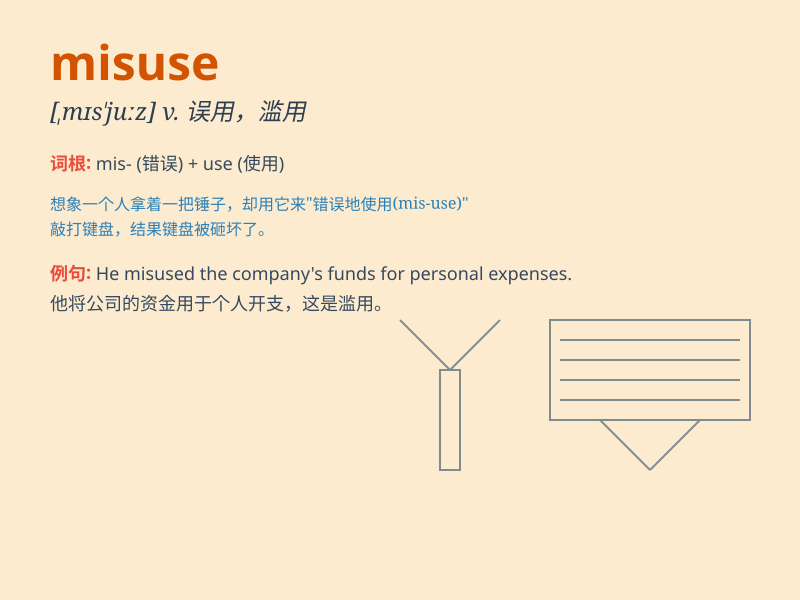

## misuse

**英音:** _[mɪs\'juːz]_ **美音:** _[,mɪs\'jus]_

**译义:** *v.误用,错用,滥用,虐待n.误用,错用,滥用,误用之实例*

### 短语

+ **misuse of power:** _滥用权力_

+ **misuse of funds:** _滥用资金_

+ **misuse of drugs:** _药物滥用_

+ **misuse of resources:** _资源滥用_

+ **misuse of language:** _语言误用_

### 例句

#### 例句1

> **He was accused of misusing company funds.**

**中文翻译:** 他被指控滥用公司资金。

**单词释义:** 滥用

#### 例句2

> **The drug can be misused and cause serious side effects.**

**中文翻译:** 这种药物可能被误用并导致严重的副作用。

**单词释义:** 误用

#### 例句3

> **She misused her position of power to gain personal benefits.**

**中文翻译:** 她滥用职权谋取个人利益。

**单词释义:** 滥用

### 背诵小故事

> A king trusted a minister, but the minister misused the power given
by the king. People were angry. Finally, the king found out and punished
the minister. Remember, misuse means to use something wrongly or in a
bad way.

**一位国王信任一位大臣，但这位大臣滥用了国王赋予的权力。民众很愤怒。最终，国王发现并惩罚了这位大臣。记住，misuse
意思是错误地或不好地使用某物。**

### 图义

