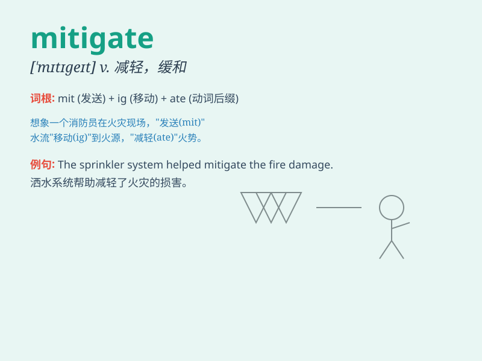

## mitigate

**英音:** _[\'mɪtɪgeɪt]_ **美音:** _[\'mɪtɪɡet]_

**译义:** *v.减轻*

### 短语

+ **mitigate the damage:** _减轻损害_

+ **mitigate the risk:** _降低风险_

+ **mitigate the impact:** _减轻影响_

+ **mitigate the consequences:** _减轻后果_

+ **mitigate the pain:** _减轻疼痛_

### 例句

#### 例句1

> **We took steps to mitigate the effects of the economic crisis.**

**中文翻译:** 我们采取措施减轻经济危机的影响。

**单词释义:** 减轻；缓和

#### 例句2

> **The new policy is designed to mitigate the environmental damage
caused by industry.**

**中文翻译:** 新政策旨在减轻工业造成的环境破坏。

**单词释义:** 减轻；缓和

#### 例句3

> **His apology helped to mitigate her anger.**

**中文翻译:** 他的道歉有助于缓和她的愤怒。

**单词释义:** 缓和；减轻

### 背诵小故事

> A king was very worried about the damage caused by a flood. His wise
advisor suggested some measures that could mitigate the disaster.
Finally, the negative effects were reduced.

**一位国王对洪水造成的破坏非常担忧。他聪明的顾问提出了一些能够减轻这场灾难的措施。最终，负面影响被降低了。**

### 图义

