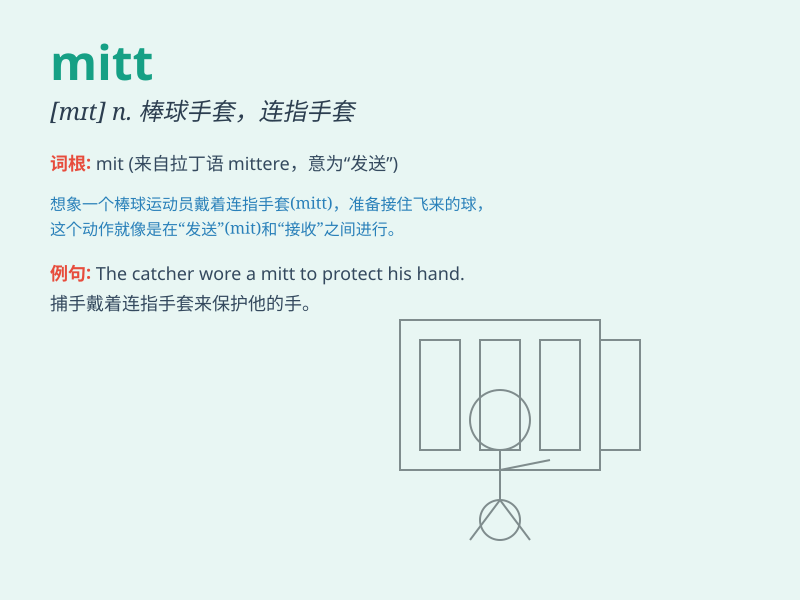

## mitt

**英音:** _[mɪt]_ **美音:** _[mɪt]_

**译义:** *n.露指手套,棒球手套,拳击手套*

### 短语

+ **baseball mitt:** _棒球手套_

+ **oven mitt:** _防热手套；烤箱手套_

+ **mitt of leather:** _皮手套_

+ **mitt for catching:** _接球手套_

+ **thick mitt:** _厚手套_

### 例句

#### 例句1

> **She wore a pair of red mitts to keep her hands warm.**

**中文翻译:** 她戴了一副红色的连指手套来保暖双手。

**单词释义:** 连指手套

#### 例句2

> **The baseball player caught the ball with his mitt.**

**中文翻译:** 这位棒球运动员用他的棒球手套接住了球。

**单词释义:** 棒球手套

#### 例句3

> **He took off his mitt and rubbed his hands.**

**中文翻译:** 他脱下手套并搓了搓手。

**单词释义:** 手套

### 背诵小故事

> One day, a little boy lost his mitt while playing in the snow. He was
very sad. But luckily, his kind sister found it for him. The mitt
protected his hand from the cold.

**有一天，一个小男孩在雪地里玩的时候弄丢了他的手套。他非常伤心。但幸运的是，他善良的姐姐帮他找到了。这只手套保护了他的手免受寒冷。**

### 图义

