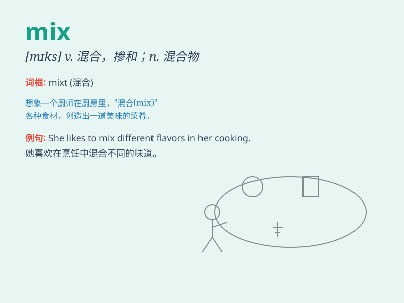

## mix

**英音:** _[mɪks]_ **美音:** _[mɪks]_

**译义:** *v.使混和,混淆,混合n.混合*

### 短语

+ **mix up:** _混淆；弄乱；弄错_

+ **mix with:** _（使）与...混合；与...交往_

+ **mix together:** _混合在一起_

+ **mix in:** _把...混入；使参与_

+ **mix and match:** _混搭；混合搭配_

### 例句

#### 例句1

> **You should mix the flour and water thoroughly.**

**中文翻译:** 你应该把面粉和水彻底搅拌均匀。

**单词释义:** 搅拌；混合

#### 例句2

> **The DJ is good at mixing different kinds of music.**

**中文翻译:** 这位 DJ 擅长混合不同种类的音乐。

**单词释义:** 混合；调配

#### 例句3

> **Don\'t mix business with pleasure.**

**中文翻译:** 别把工作和娱乐混在一起。

**单词释义:** 使混淆；使混同

### 背诵小故事

> One day, the chef needed to make a special cake. He had to mix flour,
eggs, sugar and milk together carefully. After that, a delicious cake
was made. The process of combining these ingredients is like \'mix\'.

**一天，厨师需要做一个特别的蛋糕。他得把面粉、鸡蛋、糖和牛奶仔细地混合在一起。之后，做出了美味的蛋糕。把这些食材组合的过程就像是'mix（混合）'。**

### 图义

